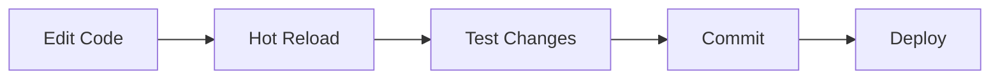

# 🚀 Quick Start Guide

> Get Vizora up and running in 5 minutes

---

## 📋 Prerequisites

- **Node.js 18+** and npm
- **Supabase account** (free tier works)
- **OpenAI API key** (for AI features)
- **Razorpay account** (optional, for payments)

---

## ⚡ Quick Setup

### 1. Clone Repository

```bash
git clone https://github.com/CaptainRushi/Vizora1.git
cd Vizora1
```

### 2. Install Dependencies

```bash
# Frontend
npm install

# Backend
cd server
npm install
cd ..
```

### 3. Configure Environment

**Frontend** (`.env`):
```env
VITE_SUPABASE_URL=your_supabase_url
VITE_SUPABASE_ANON_KEY=your_supabase_anon_key
```

**Backend** (`server/.env`):
```env
SUPABASE_URL=your_supabase_url
SUPABASE_SERVICE_ROLE_KEY=your_service_role_key
OPENAI_API_KEY=your_openai_api_key
# Optional
RAZORPAY_KEY_ID=your_razorpay_key
RAZORPAY_KEY_SECRET=your_razorpay_secret
```

### 4. Setup Database

```bash
# Apply schema
npx supabase db push
```

Or manually run `supabase/schema.sql` in your Supabase SQL editor.

### 5. Start Development

```bash
# Terminal 1: Frontend
npm run dev

# Terminal 2: Backend
cd server
npm start
```

### 6. Access Application

- Frontend: `http://localhost:5173`
- Backend: `http://localhost:3001`

---

## 🔄 Development Workflow



---

## 📁 Key Files

| File | Purpose |
|------|---------|
| `src/App.tsx` | Main React app with routes |
| `server/index.ts` | Express backend server |
| `server/parser.ts` | Schema parsing engine |
| `supabase/schema.sql` | Database schema |

---

## 🔧 Common Tasks

### Create New Page

```tsx
// src/pages/NewPage.tsx
export function NewPage() {
    return <div>New Page Content</div>;
}

// Add to App.tsx routes
<Route path="/new-page" element={<NewPage />} />
```

### Add API Endpoint

```typescript
// server/index.ts
app.get('/api/new-endpoint', async (req, res) => {
    try {
        // Your logic here
        res.json({ success: true });
    } catch (err) {
        res.status(500).json({ error: err.message });
    }
});
```

### Add Database Table

1. Add to `supabase/schema.sql`
2. Enable RLS
3. Create policies
4. Run migration

---

## 📁 Related Notes

- [[System Architecture]]
- [[Frontend Structure]]
- [[Backend Services]]

---

#quickstart #setup #development
