# 🎯 Vizora Platform Overview

> **Vizora** - Schema Intelligence Platform for Modern Developers

---

## 📌 What is Vizora?

Vizora is a **schema intelligence platform** that transforms database schemas into:
- 📊 Interactive ER diagrams
- 🤖 AI-powered documentation and insights
- 📝 Automatic architectural documentation
- 🔄 Version tracking and change history
- 👥 Team collaboration workspaces
- 🎨 Visual schema design tools

> [!tip] Core Value Proposition
> Vizora saves **10+ hours per project** on database documentation while providing operational insights, not just design tooling.

---

## 🏗️ Platform Architecture

```mermaid
graph TB
    subgraph Frontend["🖥️ Frontend (React + Vite)"]
        LP[Landing Page]
        Auth[Authentication]
        Dashboard[User Dashboard]
        Project[Project Workspace]
    end
    
    subgraph Backend["⚙️ Backend (Node.js + Express)"]
        API[REST API]
        Parser[Schema Parser]
        AI[AI Engine]
        Docs[Auto Docs Generator]
    end
    
    subgraph Database["🗄️ Database (Supabase)"]
        PG[(PostgreSQL)]
        Storage[Storage Buckets]
        AuthDB[Auth System]
    end
    
    subgraph External["🌐 External Services"]
        OpenAI[OpenAI/OpenRouter]
        Razorpay[Razorpay Payments]
    end
    
    Frontend --> Backend
    Backend --> Database
    Backend --> External
```

---

## 🔗 Quick Navigation

| Section | Description | Link |
|---------|-------------|------|
| **Architecture** | System design & data flow | [[System Architecture]] |
| **Features** | All platform features | [[Feature Index]] |
| **Database** | Schema & tables | [[Database Schema Overview]] |
| **Backend API** | API endpoints | [[API Reference]] |
| **Frontend** | UI components | [[Frontend Structure]] |
| **Billing** | Plans & payments | [[Billing System]] |
| **Roadmap** | Future features | [[Platform Roadmap]] |

---

## 📊 Platform Statistics

| Metric | Value |
|--------|-------|
| **Schema Types Supported** | SQL, Prisma, Drizzle |
| **AI Models Used** | OpenAI GPT-4o-mini |
| **Export Formats** | PNG, SVG, MD, PDF |
| **Pricing Tiers** | Free, Pro, Teams, Business |

---

## 🚀 Key Features Summary

---

## 📁 Related Notes

- [[System Architecture]]
- [[Feature Index]]
- [[Database Schema Overview]]
- [[Platform Roadmap]]

---

#vizora #overview #platform #database-tools
