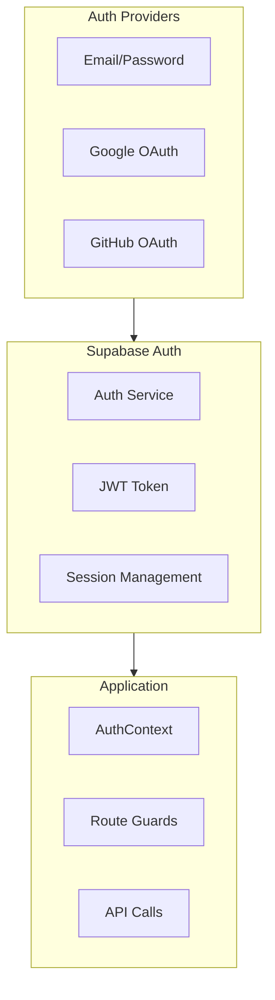
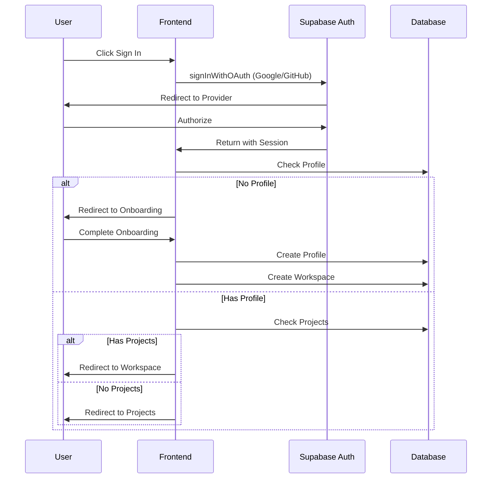
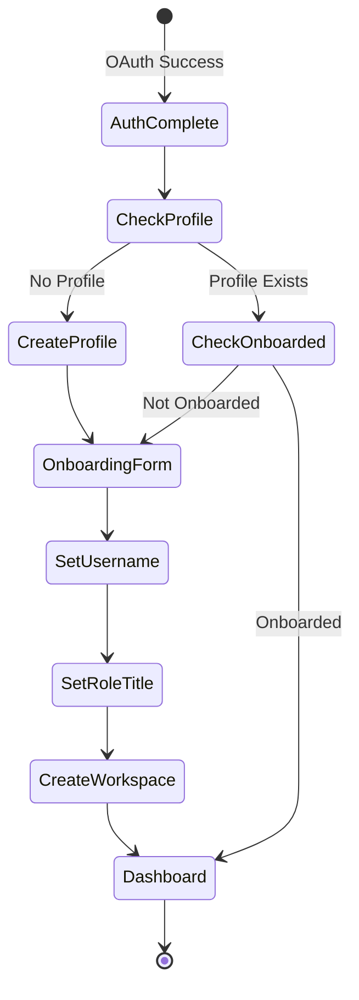

# 🔒 Authentication Flow

> Complete authentication system using Supabase Auth

---

## 📊 Auth Overview



---

## 🔄 Authentication Flow



---

## 🔧 Implementation

### AuthContext Provider

```tsx
// src/context/AuthContext.tsx
interface AuthContextType {
    user: User | null;
    loading: boolean;
    signInWithGoogle: () => Promise<void>;
    signInWithGitHub: () => Promise<void>;
    signOut: () => Promise<void>;
}

export function AuthProvider({ children }) {
    const [user, setUser] = useState<User | null>(null);
    const [loading, setLoading] = useState(true);
    
    useEffect(() => {
        // Get initial session
        supabase.auth.getSession().then(({ data: { session } }) => {
            setUser(session?.user ?? null);
            setLoading(false);
        });
        
        // Listen for auth changes
        const { data: { subscription } } = supabase.auth.onAuthStateChange(
            (event, session) => {
                setUser(session?.user ?? null);
            }
        );
        
        return () => subscription.unsubscribe();
    }, []);
    
    const signInWithGoogle = async () => {
        await supabase.auth.signInWithOAuth({
            provider: 'google',
            options: { redirectTo: `${window.location.origin}/auth/signin` }
        });
    };
    
    return (
        <AuthContext.Provider value={{ user, loading, signInWithGoogle, signOut }}>
            {children}
        </AuthContext.Provider>
    );
}
```

### Route Guards

```tsx
// AuthGuard - Protects authenticated routes
function AuthGuard({ children }) {
    const { user, loading } = useAuth();
    
    if (loading) return <LoadingSpinner />;
    if (!user) return <Navigate to="/" />;
    
    return <>{children}</>;
}

// Usage in App.tsx
<Route path="/projects" element={
    <AuthGuard>
        <Projects />
    </AuthGuard>
} />
```

### Onboarding Check

```tsx
// AuthRedirect - Handles post-login routing
function AuthRedirect() {
    const { user, loading } = useAuth();
    const navigate = useNavigate();
    
    useEffect(() => {
        if (!loading && user) {
            checkOnboarding();
        }
    }, [user, loading]);
    
    const checkOnboarding = async () => {
        const { data: profile } = await supabase
            .from('profiles')
            .select('onboarded')
            .eq('id', user.id)
            .maybeSingle();
        
        if (!profile || !profile.onboarded) {
            navigate('/onboarding');
        } else {
            navigate('/projects');
        }
    };
}
```

---

## 📋 Onboarding Flow



---

## 🔐 Security Considerations

### JWT Token Handling
- Tokens stored in browser (Supabase SDK handles)
- Auto-refresh before expiry
- Secure by default (HTTPOnly cookies optional)

### RLS Integration
```sql
-- Example RLS policy using auth.uid()
CREATE POLICY "Users can view own profile" ON profiles
FOR SELECT USING (id = auth.uid());
```

---

## 📁 Related Notes

- [[System Architecture]]
- [[Database Schema Overview]]
- [[Profiles Table]]

---

#authentication #security #supabase #oauth
