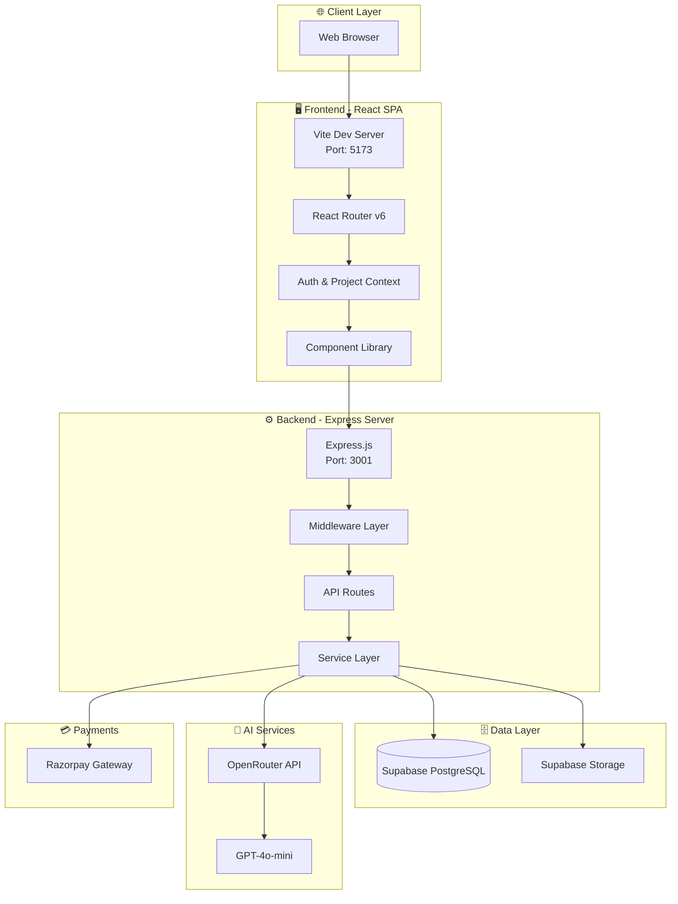
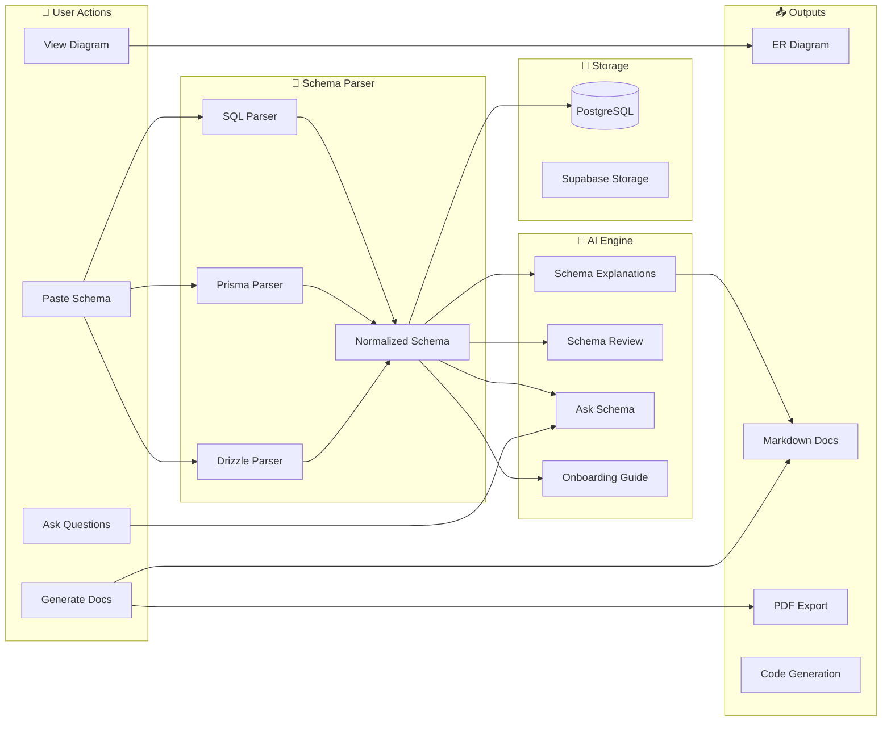
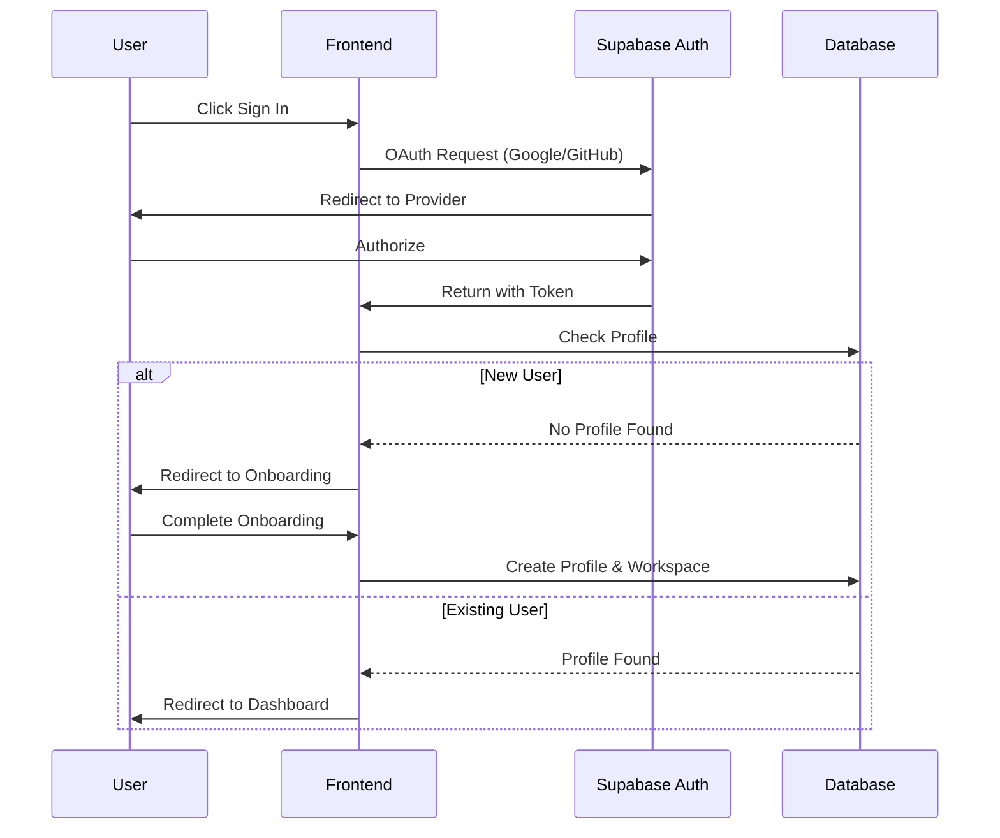
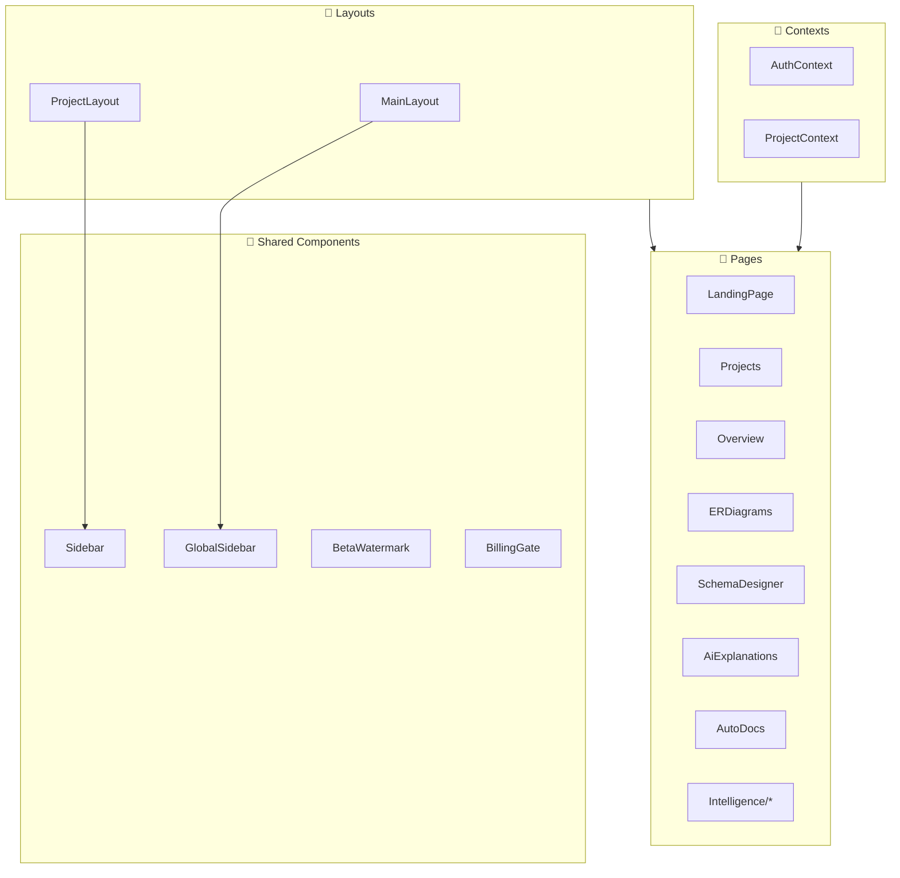

# 🏗️ System Architecture

> Complete architectural overview of the Vizora platform

---

## 📐 High-Level Architecture



---

## 📁 Project Structure

```
Vizora1/
├── 📁 src/                      # Frontend React application
│   ├── 📁 components/           # Reusable UI components
│   │   ├── 📁 dashboard/        # Dashboard-specific components
│   │   ├── 📁 beta/             # Beta features
│   │   ├── 📁 schema-designer/  # Schema designer components
│   │   └── 📁 user-dashboard/   # User account components
│   ├── 📁 pages/                # Page components (views)
│   │   ├── 📁 Intelligence/     # AI features
│   │   ├── 📁 auth/             # Authentication pages
│   │   └── 📁 account/          # Account settings
│   ├── 📁 layouts/              # Layout wrappers
│   ├── 📁 context/              # React Context providers
│   ├── 📁 hooks/                # Custom React hooks
│   └── 📁 lib/                  # Utilities and API client
├── 📁 server/                   # Backend Node.js API
│   ├── 📄 index.ts              # Main Express server
│   ├── 📄 billing.ts            # Billing logic
│   ├── 📄 razorpay.ts           # Payment integration
│   ├── 📄 parser.ts             # Schema parsing engine
│   └── 📁 src/routes/           # API route modules
├── 📁 supabase/                 # Database
│   └── 📄 schema.sql            # Complete database schema
└── 📁 public/                   # Static assets
```

---

## 🔄 Data Flow Diagram



---

## 🔐 Authentication Flow



---

## 🛠️ Tech Stack Details

### Frontend Stack

| Technology | Purpose | Version |
|------------|---------|---------|
| **React** | UI Framework | 18.x |
| **TypeScript** | Type Safety | 5.x |
| **Vite** | Build Tool | 5.x |
| **TailwindCSS** | Styling | 3.x |
| **React Router** | Navigation | 6.x |
| **ReactFlow** | Diagram Canvas | 11.x |
| **Lucide React** | Icons | Latest |

### Backend Stack

| Technology | Purpose | Version |
|------------|---------|---------|
| **Node.js** | Runtime | 18+ |
| **Express** | Web Framework | 4.x |
| **TypeScript** | Type Safety | 5.x |
| **Supabase** | Database & Auth | Latest |
| **OpenAI SDK** | AI Integration | 4.x |
| **Puppeteer** | PDF Generation | Latest |

---

## 📊 Component Architecture



---

## 🔗 Related Notes

- [[API Reference]]
- [[Database Schema Overview]]
- [[Frontend Structure]]
- [[Backend Services]]

---

#architecture #system-design #vizora
