# 🤖 AI Explanations

> AI-powered schema explanations at database, table, and relationship levels

---

## 🎯 Purpose

Generate intelligent, context-aware explanations of your database schema using AI. Get insights at three levels:
1. **Database Level** - Overall schema understanding
2. **Table Level** - Individual table purposes
3. **Relationship Level** - How data connects

---

## 📊 Explanation Levels

```mermaid
graph TB
    subgraph Levels["AI Explanation Levels"]
        DB["🗄️ Database Level<br/>Overall schema purpose"]
        Table["📦 Table Level<br/>Individual table insights"]
        Rel["🔗 Relationship Level<br/>Data connections"]
    end
    
    subgraph Plans["Access by Plan"]
        Free["Free: DB only"]
        Pro["Pro: DB + Tables"]
        Teams["Teams+: All Levels"]
    end
    
    DB --> Free
    DB --> Pro
    Table --> Pro
    DB --> Teams
    Table --> Teams
    Rel --> Teams
```



---

## 🔧 Technical Implementation

### Backend Engine
- **File**: `server/index.ts`
- **Function**: `generateAndSaveExplanations()`
- **AI Model**: OpenAI GPT-4o-mini via OpenRouter

### System Prompt

```
You are a senior backend engineer and database architect.
Your task is to explain a database schema clearly and accurately.

Rules:
- Explain ONLY what is present in the schema.
- Do NOT invent tables, columns, or relationships.
- Do NOT guess business logic.
- Use plain English.
- Be concise but clear.
- Use developer-friendly language.
```

---

## 🔄 Generation Flow


---

## 📋 Explanation Modes

| Mode | Audience | Style |
|------|----------|-------|
| **Developer** | Engineers | Technical, precise |
| **Manager** | Non-technical | Business-focused |
| **Onboarding** | New team members | Educational |

---

## 💾 Database Schema

```sql
CREATE TABLE schema_explanations (
    id UUID PRIMARY KEY,
    project_id UUID REFERENCES projects(id),
    version_number INT NOT NULL,
    entity_type TEXT NOT NULL,  -- 'database', 'table', 'relationship'
    entity_name TEXT,           -- null for database, table name otherwise
    mode TEXT NOT NULL,         -- 'developer', 'manager', etc.
    content TEXT NOT NULL,
    created_at TIMESTAMPTZ
);
```

---

## 📊 Example Outputs

### Database-Level Explanation
> "This database schema represents a multi-tenant SaaS platform with workspace-based organization. The core entities include users (profiles), workspaces, and projects. Each workspace can have multiple members with role-based access control. The schema supports billing integration with plan-based feature gating..."

### Table-Level Explanation
> "The `projects` table serves as the central container for all schema-related operations. Each project belongs to a workspace and has an owner. Projects track their current workflow step and support versioned schema storage through the `schema_versions` table..."

---

## ⚙️ API Endpoint

### `POST /projects/:id/explanations`

**Request Body:**
```json
{
    "version_number": 1,
    "mode": "developer"
}
```

**Response:**
```json
{
    "success": true,
    "explanations": [
        {
            "entity_type": "database",
            "entity_name": null,
            "content": "This database..."
        },
        {
            "entity_type": "table",
            "entity_name": "users",
            "content": "The users table..."
        }
    ]
}
```

---

## 🔐 Billing Integration


---

## 📁 Related Notes

- [[Schema Review]]
- [[Ask Schema]]
- [[Onboarding Guide]]
- [[Billing System]]

---

#feature #ai #explanations #intelligence
