# 💬 Ask Schema

> Natural language queries about your database schema

---

## 🎯 Purpose

Ask questions about your schema in plain English and get AI-powered answers with context-aware insights referencing specific tables and relationships.

---

## 💡 Example Questions

- "How are users and posts related?"
- "What tables store payment information?"
- "Explain the authentication flow"
- "Which tables have foreign keys to users?"
- "What is the purpose of the workspace_billing table?"

---

## 🔄 Query Flow


---

## 🔧 Technical Implementation

### Backend Route
- **File**: `server/src/routes/askSchema.ts`
- **Endpoint**: `POST /api/schema/:projectId/ask`

### Request Structure

```typescript
interface AskSchemaRequest {
    question: string;
    version_number?: number;  // defaults to latest
}
```

### Response Structure

```typescript
interface AskSchemaResponse {
    answer: string;
    referenced_tables: string[];
    schema_version: number;
}
```

---

## 📋 System Prompt

```
You are a database expert assistant. Given a database schema and a user question:

1. Answer ONLY based on the schema provided
2. Reference specific tables and columns
3. Do not invent relationships or fields
4. Be concise and accurate
5. If uncertain, say so

Schema:
{normalized_schema}

Question: {user_question}
```

---

## 💾 Query Logging

```sql
CREATE TABLE ask_schema_logs (
    id UUID PRIMARY KEY,
    project_id UUID REFERENCES projects(id),
    schema_version INT,
    question TEXT NOT NULL,
    referenced_tables TEXT[],
    created_at TIMESTAMPTZ
);
```

---

## 🖥️ Frontend Component

```mermaid
graph TB
    subgraph AskSchema["Ask Schema Interface"]
        Input["💬 Question Input"]
        Submit["🚀 Ask Button"]
        
        subgraph Response["AI Response"]
            Answer["📝 Answer Text"]
            Tables["📦 Referenced Tables"]
        end
        
        subgraph History["Query History"]
            Q1["Previous Question 1"]
            Q2["Previous Question 2"]
        end
    end
    
    Input --> Submit
    Submit --> Response
```



---

## 📊 Example Interaction

**Question:**
> "How does the billing system work?"

**Answer:**
> "The billing system is workspace-centric, managed through three main tables:
> 
> 1. **billing_plans**: Defines available subscription tiers (free, pro, teams, business) with their limits and features.
> 
> 2. **workspace_billing**: Tracks the active plan for each workspace, including status and expiration date.
> 
> 3. **payments**: Logs payment transactions with Razorpay integration, storing order IDs and payment status.
> 
> When a workspace upgrades, a payment record is created, and upon successful payment, the workspace_billing table is updated with the new plan and expiry date."

**Referenced Tables:** `billing_plans`, `workspace_billing`, `payments`, `workspaces`

---

## ⚙️ API Endpoint

### `POST /api/schema/:projectId/ask`

**Request:**
```json
{
    "question": "How are users authenticated?"
}
```

**Response:**
```json
{
    "answer": "Users are authenticated through Supabase Auth...",
    "referenced_tables": ["profiles", "auth.users"],
    "schema_version": 3
}
```

---

## 📁 Related Notes

- [[AI Explanations]]
- [[Schema Review]]
- [[Onboarding Guide]]

---

#feature #ai #ask #intelligence #nlp
