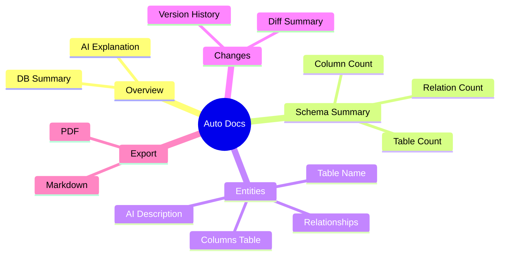
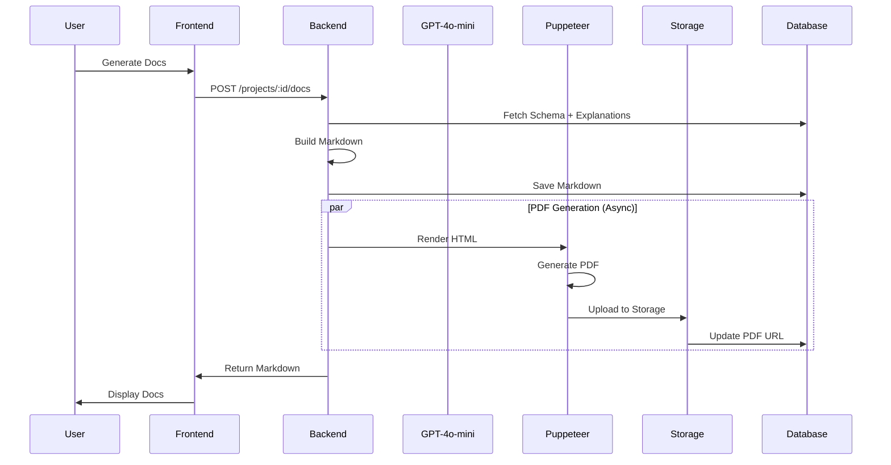

# 📄 Auto Documentation

> Automatic generation of schema documentation in Markdown and PDF formats

---

## 🎯 Purpose

Automatically generate comprehensive database documentation including:
- Database overview
- Table descriptions
- Column specifications
- Relationship documentation
- Change history
- Exportable to PDF

---

## 📊 Document Structure



---

## 🔄 Generation Flow



---

## 🔧 Technical Implementation

### Backend Functions
- **File**: `server/index.ts`
- **Functions**: 
  - `generateDocumentation()` - Creates markdown
  - `generatePdf()` - Renders PDF with Puppeteer

### Markdown Generation

```typescript
async function generateDocumentation(projectId: string, version: number) {
    // 1. Load schema and explanations
    const { data: version } = await supabase
        .from('schema_versions')
        .select('*')
        .eq('project_id', projectId)
        .eq('version', versionNumber)
        .single();
    
    // 2. Build markdown sections
    let md = `# Database Documentation\n\n`;
    md += `## Overview\n${dbExplanation}\n\n`;
    md += `## Schema Summary\n`;
    md += `- **Total Tables:** ${tableCount}\n`;
    
    // 3. Entity documentation
    for (const [tableName, table] of Object.entries(schema.tables)) {
        md += `### ${tableName}\n`;
        md += `${tableExplanation}\n\n`;
        md += `| Column | Type | Constraints |\n`;
        // ... columns table
    }
    
    // 4. Save to database
    await supabase.from('documentation_outputs').insert({
        project_id: projectId,
        version: versionNumber,
        markdown: md
    });
}
```

---

## 📋 Document Template

```markdown
# Database Documentation

## Overview
{AI-generated database explanation}

## Schema Summary
- **Total Tables:** 12
- **Total Columns:** 87
- **Total Relationships:** 15

## Entities

### users
{AI-generated table explanation}

#### Columns
| Column | Type | Constraints | Description |
|--------|------|-------------|-------------|
| id | UUID | PK | Unique identifier |
| email | TEXT | UNIQUE, NOT NULL | User email |
| name | TEXT | | Display name |

#### Key Relationships
- **profiles** → **users** (1:1)
- **posts** → **users** (N:1)

---

### posts
{AI-generated table explanation}

...

## Relationships Detail
{AI-generated relationship explanation}

## Version Change History
- **[TABLE ADDED]**: notifications
- **[COLUMN MODIFIED]**: users.role

---
*Generated by Vizora AI Engine*
```

---

## 📤 PDF Generation

### Puppeteer Configuration

```typescript
const browser = await puppeteer.launch({
    headless: true,
    args: ['--no-sandbox', '--disable-setuid-sandbox']
});

const page = await browser.newPage();
await page.setContent(htmlContent);

const pdfBuffer = await page.pdf({
    format: 'A4',
    margin: { top: '1.5cm', bottom: '1.5cm', left: '1.5cm', right: '1.5cm' },
    printBackground: true
});
```

### PDF Styling

```css
body { 
    font-family: 'Inter', system-ui, sans-serif; 
    line-height: 1.6; 
    color: #1e293b;
}
h1 { 
    color: #0f172a; 
    border-bottom: 3px solid #4f46e5; 
}
h3 { 
    background: #f8fafc; 
    border-left: 4px solid #4f46e5; 
}
table { 
    width: 100%; 
    border-collapse: collapse; 
}
```

---

## 💾 Database Schema

```sql
CREATE TABLE documentation_outputs (
    id UUID PRIMARY KEY,
    project_id UUID REFERENCES projects(id),
    version INT NOT NULL,
    pdf_url TEXT,
    markdown TEXT,
    created_at TIMESTAMPTZ
);
```

---

## ⚙️ API Endpoints

### Generate Docs
`POST /projects/:id/docs`

**Request:**
```json
{
    "version_number": 1
}
```

**Response:**
```json
{
    "success": true,
    "markdown": "# Database Documentation...",
    "pdf_url": null  // Available after async generation
}
```

### Get Docs
`GET /projects/:id/docs?version=1`

**Response:**
```json
{
    "markdown": "# Database Documentation...",
    "pdf_url": "https://storage.supabase.co/.../docs.pdf"
}
```

---

## 📁 Related Notes

- [[AI Explanations]]
- [[Export Features]]
- [[Version History]]

---

#feature #documentation #export #core
