# 🔄 Change Tracking

> Detailed diff between schema versions with change categorization

---

## 🎯 Purpose

Track and visualize changes between schema versions:
- Table additions/removals
- Column modifications
- Relationship changes
- Index updates

---

## 📊 Change Categories


---

## 🔧 Technical Implementation

### Compare Schemas Function

```typescript
interface ChangeObject {
    change_type: 'table_added' | 'table_removed' | 
                 'column_added' | 'column_removed' | 'column_modified' |
                 'relation_added' | 'relation_removed' | 'relation_modified';
    entity_name: string;
    details: any;
}

function compareSchemas(
    oldSchema: NormalizedSchema, 
    newSchema: NormalizedSchema
): ChangeObject[] {
    const changes: ChangeObject[] = [];
    
    // Check for added tables
    for (const tableName of Object.keys(newSchema.tables)) {
        if (!oldSchema.tables[tableName]) {
            changes.push({
                change_type: 'table_added',
                entity_name: tableName,
                details: newSchema.tables[tableName]
            });
        }
    }
    
    // Check for removed tables
    for (const tableName of Object.keys(oldSchema.tables)) {
        if (!newSchema.tables[tableName]) {
            changes.push({
                change_type: 'table_removed',
                entity_name: tableName,
                details: oldSchema.tables[tableName]
            });
        }
    }
    
    // Compare columns...
    // Compare relations...
    
    return changes;
}
```

---

## 💾 Database Schema

```sql
CREATE TABLE schema_changes (
    id UUID PRIMARY KEY,
    project_id UUID REFERENCES projects(id),
    from_version INT,        -- null for initial version
    to_version INT NOT NULL,
    change_type TEXT NOT NULL,
    entity_name TEXT NOT NULL,
    details JSONB,
    created_at TIMESTAMPTZ
);
```

---

## 📋 Change Details Examples

### Table Added
```json
{
    "change_type": "table_added",
    "entity_name": "notifications",
    "details": {
        "columns": {
            "id": { "type": "UUID", "primary": true },
            "user_id": { "type": "UUID", "foreign_key": "users.id" },
            "message": { "type": "TEXT" }
        }
    }
}
```

### Column Modified
```json
{
    "change_type": "column_modified",
    "entity_name": "users.email",
    "details": {
        "old": { "type": "TEXT", "nullable": true },
        "new": { "type": "TEXT", "nullable": false, "unique": true }
    }
}
```

---

## 🖥️ Version Compare UI

```mermaid
graph TB
    subgraph Compare["Version Compare"]
        Header["Compare v3 ↔ v4"]
        
        subgraph Changes["Changes"]
            Added["🟢 Added"]
            Removed["🔴 Removed"]
            Modified["🟡 Modified"]
        end
        
        subgraph Details["Change Details"]
            D1["+table: notifications"]
            D2["+column: users.avatar_url"]
            D3["~column: posts.status"]
        end
    end
```



---

## ⚙️ API Endpoints

### Get Diff Between Versions
`GET /projects/:id/diff?from=3&to=4`

```json
{
    "from_version": 3,
    "to_version": 4,
    "changes": [
        {
            "change_type": "table_added",
            "entity_name": "notifications",
            "details": {...}
        },
        {
            "change_type": "column_added",
            "entity_name": "users.last_login",
            "details": {...}
        }
    ],
    "summary": {
        "tables_added": 1,
        "tables_removed": 0,
        "columns_added": 3,
        "columns_removed": 0,
        "columns_modified": 1
    }
}
```

---

## 📊 Change Visualization

| Symbol | Meaning | Color |
|--------|---------|-------|
| `+` | Added | Green |
| `-` | Removed | Red |
| `~` | Modified | Yellow |
| `→` | Renamed | Blue |

---

## 📁 Related Notes

- [[Version History]]
- [[Version Compare]]
- [[Schema Input]]

---

#feature #changes #diff #versions
