# 📊 ER Diagram Generation

> Auto-generate interactive Entity-Relationship diagrams from schemas

---

## 🎯 Purpose

Automatically transforms parsed database schemas into beautiful, interactive ER diagrams that visualize tables, columns, relationships, and constraints.

---

## 🖼️ Visual Overview

```mermaid
graph TB
    subgraph Diagram["ER Diagram Canvas"]
        subgraph Users["📦 users"]
            U1[id: UUID - PK]
            U2[email: TEXT]
            U3[name: TEXT]
        end
        
        subgraph Posts["📦 posts"]
            P1[id: UUID - PK]
            P2[title: TEXT]
            P3[author_id: UUID - FK]
        end
        
        Users -->|1:N| Posts
    end
```



---

## 🔧 Technical Implementation

### Frontend Component
- **File**: `src/pages/ERDiagrams.tsx`
- **Library**: ReactFlow
- **Features**:
  - Interactive pan and zoom
  - MiniMap navigation
  - Export to PNG/SVG
  - Table node customization

### Node Structure

```typescript
interface TableNode {
    id: string;
    type: 'table';
    position: { x: number; y: number };
    data: {
        tableName: string;
        columns: {
            name: string;
            type: string;
            isPrimary: boolean;
            isForeign: boolean;
            nullable: boolean;
        }[];
    };
}
```

---

## 🔄 Diagram Generation Flow


---

## 🎨 Visual Features

| Feature | Description |
|---------|-------------|
| **Auto-Layout** | Automatic positioning of tables |
| **Interactive** | Pan, zoom, drag tables |
| **MiniMap** | Overview navigation |
| **Controls** | Zoom in/out, fit view |
| **Styling** | Color-coded constraints (PK, FK) |
| **Export** | PNG, SVG download |

---

## 📦 Table Node Component

```tsx
function TableNode({ data }: NodeProps) {
    return (
        <div className="table-node">
            <Handle type="target" position={Position.Left} />
            
            <div className="table-header">
                {data.tableName}
            </div>
            
            <div className="table-columns">
                {data.columns.map(col => (
                    <div className="column-row" key={col.name}>
                        <span className="column-name">{col.name}</span>
                        <span className="column-type">{col.type}</span>
                        {col.isPrimary && <span className="pk-badge">PK</span>}
                        {col.isForeign && <span className="fk-badge">FK</span>}
                    </div>
                ))}
            </div>
            
            <Handle type="source" position={Position.Right} />
        </div>
    );
}
```

---

## 🔗 Edge Types


---

## ⚙️ API Integration

### Fetch Diagram Data

```typescript
// Get schema for diagram
const { data } = await supabase
    .from('schema_versions')
    .select('normalized_schema')
    .eq('project_id', projectId)
    .eq('version', versionNumber)
    .single();

// Transform to nodes/edges
const { nodes, edges } = transformSchemaToFlow(data.normalized_schema);
```

---

## 📤 Export Options

| Format | Plan | Description |
|--------|------|-------------|
| **PNG** | Pro+ | High-resolution image |
| **SVG** | Pro+ | Vector format |
| **JSON** | All | Raw diagram data |

---

## 📁 Related Notes

- [[Schema Input]]
- [[Schema Designer]]
- [[Export Features]]

---

#feature #diagram #visualization #core
