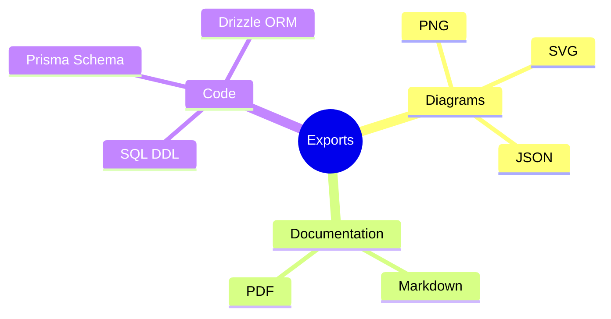
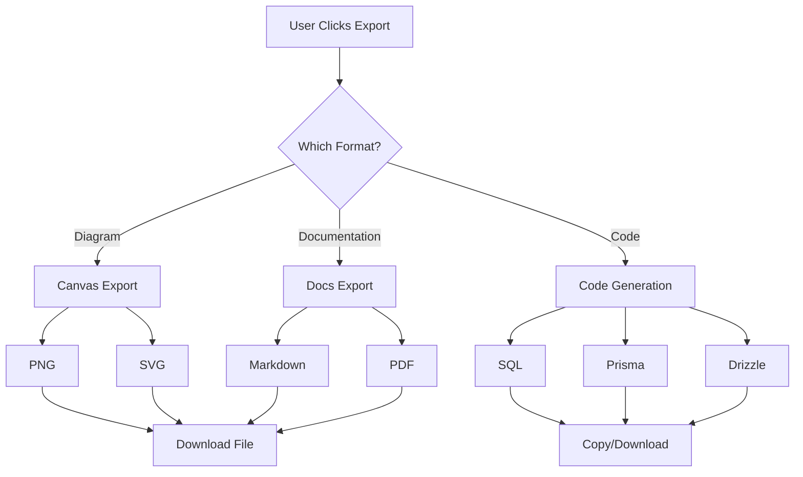
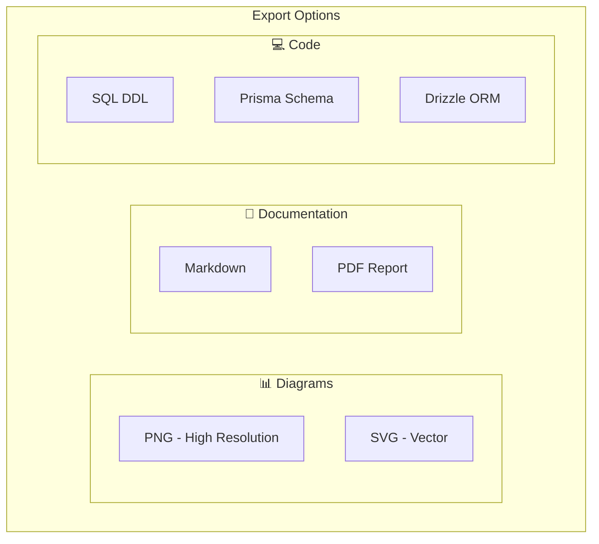

# 📤 Export Features

> Export diagrams and documentation in multiple formats

---

## 🎯 Purpose

Export your schema work in various formats for sharing, documentation, and integration:
- PNG/SVG diagrams
- Markdown documentation
- PDF reports
- Raw code (SQL, Prisma, Drizzle)

---

## 📊 Export Formats



---

## 📋 Export Matrix

| Format | Type | Plan | Description |
|--------|------|------|-------------|
| **PNG** | Image | Pro+ | High-resolution diagram |
| **SVG** | Vector | Pro+ | Scalable vector graphic |
| **JSON** | Data | All | Raw diagram/schema data |
| **Markdown** | Docs | All | Documentation text |
| **PDF** | Docs | Pro+ | Formatted document |
| **SQL** | Code | All | DDL statements |
| **Prisma** | Code | All | Prisma schema file |
| **Drizzle** | Code | All | Drizzle ORM schema |

---

## 🔧 Implementation Details

### Diagram Export (PNG/SVG)

```typescript
// Using ReactFlow's built-in export
import { toPng, toSvg } from 'react-flow-renderer';

async function exportDiagram(format: 'png' | 'svg') {
    const flowElement = document.querySelector('.react-flow');
    
    if (format === 'png') {
        const dataUrl = await toPng(flowElement, {
            quality: 1,
            backgroundColor: '#ffffff'
        });
        downloadFile(dataUrl, `schema-diagram.png`);
    } else {
        const dataUrl = await toSvg(flowElement);
        downloadFile(dataUrl, `schema-diagram.svg`);
    }
}
```

### PDF Export (Backend)

```typescript
async function generatePdf(markdown: string) {
    const browser = await puppeteer.launch({
        headless: true,
        args: ['--no-sandbox']
    });
    
    const page = await browser.newPage();
    await page.setContent(renderMarkdownToHtml(markdown));
    
    const pdf = await page.pdf({
        format: 'A4',
        margin: { top: '1.5cm', bottom: '1.5cm' },
        printBackground: true
    });
    
    await browser.close();
    return pdf;
}
```

### Code Generation

```typescript
// SQL Generation
function generateSql(schema: NormalizedSchema): string {
    return Object.entries(schema.tables)
        .map(([name, table]) => {
            const columns = Object.entries(table.columns)
                .map(([col, def]) => formatColumn(col, def))
                .join(',\n');
            return `CREATE TABLE ${name} (\n${columns}\n);`;
        })
        .join('\n\n');
}

// Prisma Generation
function generatePrisma(schema: NormalizedSchema): string {
    return Object.entries(schema.tables)
        .map(([name, table]) => {
            const fields = Object.entries(table.columns)
                .map(([col, def]) => formatPrismaField(col, def))
                .join('\n');
            return `model ${pascalCase(name)} {\n${fields}\n}`;
        })
        .join('\n\n');
}
```

---

## 🔄 Export Flow



---

## 📤 Export Options UI



---

## 🔐 Billing Gate

Premium export features require Pro+ plan:

```tsx
<BillingGate feature="exports">
    <ExportButton format="png" />
    <ExportButton format="pdf" />
</BillingGate>
```

---

## 📁 Related Notes

- [[Auto Documentation]]
- [[ER Diagram Generation]]
- [[Schema Designer]]
- [[Billing System]]

---

#feature #export #documentation #diagrams
