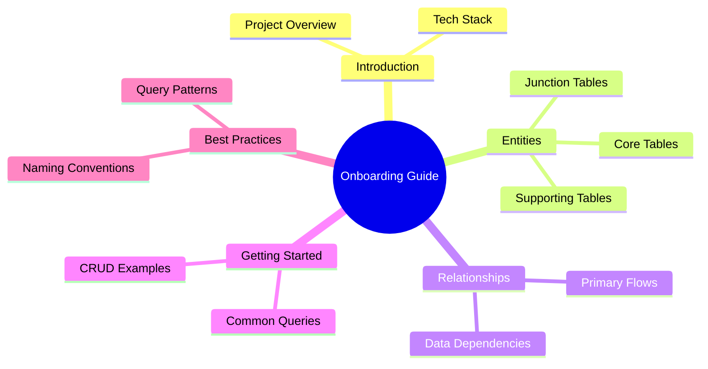
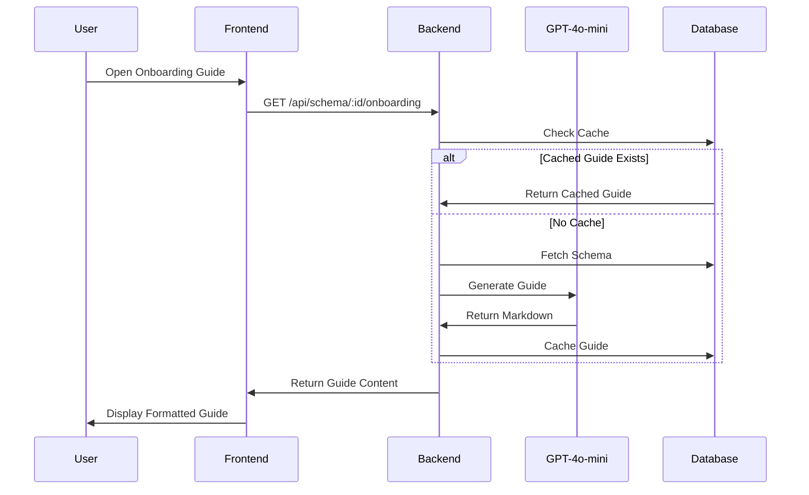

# 📚 Onboarding Guide

> AI-generated project introduction documentation for new team members

---

## 🎯 Purpose

Automatically generate comprehensive "getting started" documentation for your schema, helping new developers understand the database quickly with:
- Entity overview
- Key relationships
- Common queries
- Best practices

---

## 📊 Guide Structure



---

## 🔄 Generation Flow



---

## 🔧 Technical Implementation

### Backend Route
- **File**: `server/src/routes/onboardingGuide.ts`
- **Endpoint**: `GET /api/schema/:projectId/onboarding`

### Caching Strategy

```typescript
// Check for existing guide
const { data: cached } = await supabase
    .from('onboarding_guides')
    .select('content')
    .eq('project_id', projectId)
    .eq('version_number', version)
    .single();

if (cached) {
    return res.json({ content: cached.content, cached: true });
}
```

---

## 💾 Database Schema

```sql
CREATE TABLE onboarding_guides (
    id UUID PRIMARY KEY,
    project_id UUID REFERENCES projects(id),
    version_number INT NOT NULL,
    content TEXT NOT NULL,
    created_at TIMESTAMPTZ,
    UNIQUE(project_id, version_number)
);
```

---

## 📋 Example Guide Output

```markdown
# 🚀 Database Onboarding Guide

## Overview
This database powers a workspace-based SaaS platform with 
multi-tenant architecture and role-based access control.

## Core Entities

### Users & Workspaces
- **profiles**: User account information
- **workspaces**: Organization containers (personal/team)
- **workspace_members**: Many-to-many user-workspace with roles

### Projects & Schemas
- **projects**: Schema container with version tracking
- **schema_versions**: Immutable version history
- **diagram_states**: Visual diagram configurations

## Key Relationships

```
profiles ──< workspace_members >── workspaces
                                       │
                                       └── projects
                                             │
                                             └── schema_versions
```

## Common Queries

### Get User's Workspaces
```sql
SELECT w.* 
FROM workspaces w
JOIN workspace_members wm ON w.id = wm.workspace_id
WHERE wm.user_id = :user_id;
```

### Get Project's Latest Schema
```sql
SELECT * FROM schema_versions
WHERE project_id = :project_id
ORDER BY version DESC
LIMIT 1;
```
```

---

## ⚙️ API Response

```json
{
    "content": "# 🚀 Database Onboarding Guide\n\n...",
    "version_number": 1,
    "cached": false,
    "generated_at": "2024-01-14T12:00:00Z"
}
```

---

## 📁 Related Notes

- [[AI Explanations]]
- [[Auto Documentation]]
- [[Ask Schema]]

---

#feature #ai #onboarding #intelligence #documentation
