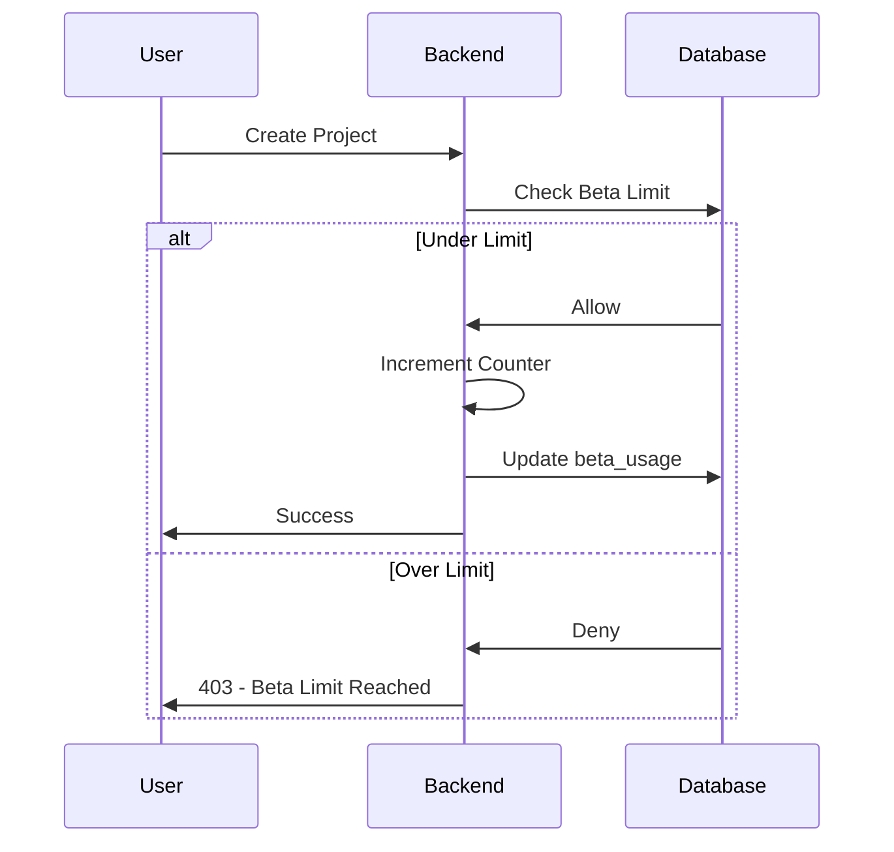

# 🧪 Private Beta System

> Beta testing infrastructure and usage tracking

---

## 🎯 Purpose

Manage the private beta phase:
- Limit user access to features
- Track usage patterns
- Collect feedback
- Prepare for launch

---

## 📊 Beta Configuration

```typescript
// server/index.ts
const BETA_MODE = true;
const BETA_PROJECT_LIMIT = 2;
const BETA_VERSION_LIMIT = 4;
const BETA_LABEL = "Private Beta";
```

---

## 💾 Beta Tables

### beta_usage
```sql
CREATE TABLE beta_usage (
    user_id UUID PRIMARY KEY REFERENCES auth.users(id),
    projects_created INT DEFAULT 0,
    versions_created INT DEFAULT 0,
    diagrams_viewed INT DEFAULT 0,
    docs_generated INT DEFAULT 0,
    beta_ends_at TIMESTAMPTZ,
    first_used_at TIMESTAMPTZ DEFAULT NOW(),
    last_used_at TIMESTAMPTZ DEFAULT NOW()
);
```

### user_feedback
```sql
CREATE TABLE user_feedback (
    id UUID PRIMARY KEY,
    user_id UUID NOT NULL REFERENCES auth.users(id),
    project_id UUID REFERENCES projects(id),
    context TEXT,  -- dashboard | diagram | docs | schema_paste | limit_hit
    rating INT CHECK (rating >= 1 AND rating <= 5),
    answer_confusing TEXT,
    answer_helpful TEXT,
    answer_missing TEXT,
    created_at TIMESTAMPTZ DEFAULT NOW()
);
```

---

## 🔄 Usage Tracking Flow



---

## 📊 Beta Limits

| Resource | Limit | Enforced By |
|----------|-------|-------------|
| Projects | 2 | Backend + DB Trigger |
| Versions | 4 | Backend Logic |
| AI Calls | Unlimited* | Beta Override |
| Exports | Unlimited* | Beta Override |
| Designer | Unlimited* | Beta Override |

> *All billing limits are disabled during beta

---

## 🔧 Beta Override in Billing

```typescript
// server/billing.ts
export async function checkProjectLimit(workspaceId: string) {
    // BETA OVERRIDE: Disable billing limits during beta
    return { allowed: true };
}

export async function checkFeatureAccess(workspaceId: string, feature: string) {
    return true; // Beta Override: Enable all features
}

export async function getAiAccessLevel(workspaceId: string) {
    return 'full'; // Beta Override: Give full AI access
}
```

---

## 💬 Feedback Collection

### FeedbackNudge Component

```tsx
function FeedbackNudge({ context }) {
    // Shows after key actions
    // Contexts: 'diagram', 'docs', 'schema_paste', 'limit_hit'
    
    return (
        <div className="feedback-card">
            <h3>How was this experience?</h3>
            <StarRating max={5} />
            <textarea placeholder="What's missing?" />
            <button>Submit Feedback</button>
        </div>
    );
}
```

### Feedback Anti-Spam

```typescript
// Max 3 feedback submissions per 10 minutes
const tenMinsAgo = new Date(Date.now() - 10 * 60 * 1000);
const { count } = await supabase
    .from('user_feedback')
    .select('*', { count: 'exact', head: true })
    .eq('user_id', userId)
    .gte('created_at', tenMinsAgo);

if (count >= 3) {
    return res.status(429).json({ error: "Too many submissions" });
}
```

---

## 📊 Beta Watermark

```tsx
// components/BetaWatermark.tsx
function BetaWatermark() {
    return (
        <>
            <div className="fixed top-2 left-2 text-xs text-gray-400/50">
                Vizora Beta
            </div>
            <div className="fixed top-2 right-2 text-xs text-gray-400/50">
                Vizora Beta
            </div>
            <div className="fixed bottom-2 left-2 text-xs text-gray-400/50">
                Vizora Beta
            </div>
            <div className="fixed bottom-2 right-2 text-xs text-gray-400/50">
                Vizora Beta
            </div>
        </>
    );
}
```

---

## 📁 Related Notes

- [[Platform Roadmap]]
- [[Billing System]]
- [[Feature Index]]

---

#beta #testing #feedback #limits
