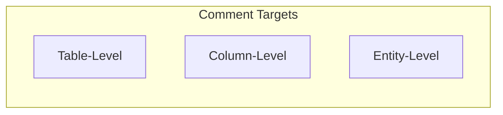

# 💬 Schema Comments

> Add contextual comments to tables and columns

---

## 🎯 Purpose

Document your schema with inline comments:
- Explain business logic
- Add context for team members
- Document edge cases
- Track decisions

---

## 📊 Comment Types



---

## 💾 Database Schema

```sql
CREATE TABLE schema_comments (
    id UUID PRIMARY KEY DEFAULT gen_random_uuid(),
    project_id UUID REFERENCES projects(id) ON DELETE CASCADE,
    entity_name TEXT NOT NULL,
    comment TEXT NOT NULL,
    created_at TIMESTAMPTZ DEFAULT NOW(),
    updated_at TIMESTAMPTZ DEFAULT NOW(),
    UNIQUE(project_id, entity_name)
);
```

---

## 📋 Usage Examples

### Add Table Comment
```typescript
await supabase
    .from('schema_comments')
    .upsert({
        project_id: projectId,
        entity_name: 'users',
        comment: 'Core user table. Soft delete not implemented - use is_active flag.'
    });
```

### Add Column Comment
```typescript
await supabase
    .from('schema_comments')
    .upsert({
        project_id: projectId,
        entity_name: 'users.created_at',
        comment: 'Auto-set by Supabase trigger. Do not manually modify.'
    });
```

---

## ⚙️ API Endpoints

### Get Comments
```http
GET /projects/:id/comments
```

### Add/Update Comment
```http
POST /projects/:id/comments
{
    "entity_name": "users",
    "comment": "Core user table..."
}
```

---

## 🔐 Plan Requirement

Schema Comments require **Teams+** plan.

---

## 📁 Related Notes

- [[Schema Input]]
- [[Team Collaboration]]
- [[Billing System]]

---

#feature #comments #teams #documentation
