# 🎨 Schema Designer

> Visual database schema designer with drag-and-drop interface

---

## 🎯 Purpose

Design database schemas visually without writing SQL:
- Drag-and-drop table creation
- Visual relationship connections
- Automatic code generation (SQL, Prisma, Drizzle)
- Real-time schema updates

---

## 📊 Feature Overview


---

## 🔧 Technical Implementation

### Frontend Component
- **File**: `src/pages/SchemaDesigner.tsx`
- **Library**: ReactFlow with custom nodes

### Custom Table Node

```tsx
function TableNode({ id, data, selected }: NodeProps) {
    return (
        <div className={`table-node ${selected ? 'selected' : ''}`}>
            <Handle type="target" position={Position.Left} />
            
            <div className="table-header">
                <input 
                    value={data.tableName}
                    onChange={(e) => updateTableName(id, e.target.value)}
                />
                <button onClick={() => addColumn(id)}>+ Column</button>
            </div>
            
            <div className="columns">
                {data.columns.map((col, i) => (
                    <ColumnRow 
                        key={i}
                        column={col}
                        onUpdate={(updates) => updateColumn(id, i, updates)}
                        onDelete={() => deleteColumn(id, i)}
                    />
                ))}
            </div>
            
            <Handle type="source" position={Position.Right} />
        </div>
    );
}
```

---

## 🖥️ Interface Layout

```mermaid
graph LR
    subgraph UI["Designer Interface"]
        subgraph Toolbar["🔧 Toolbar"]
            T1[+ Add Table]
            T2[Save Schema]
            T3[Generate Code]
        end
        
        subgraph Canvas["📐 Canvas"]
            Table1[users]
            Table2[posts]
            Table3[comments]
            Table1 --> Table2
            Table2 --> Table3
        end
        
        subgraph Panel["📋 Code Panel"]
            Code[Generated SQL/Prisma/Drizzle]
        end
    end
```



---

## 🔄 State Management

### Schema State

```typescript
interface DesignerState {
    nodes: TableNode[];
    edges: RelationEdge[];
    selectedNode: string | null;
    selectedEdge: string | null;
}

interface TableNode {
    id: string;
    type: 'table';
    position: { x: number; y: number };
    data: {
        tableName: string;
        columns: Column[];
    };
}

interface Column {
    name: string;
    type: string;
    primary: boolean;
    nullable: boolean;
    unique: boolean;
    foreignKey?: string;
}
```

---

## 📝 Code Generation

### SQL Generation

```typescript
function generateSql(schema: NormalizedSchema): string {
    let sql = '';
    
    for (const [tableName, table] of Object.entries(schema.tables)) {
        sql += `CREATE TABLE ${tableName} (\n`;
        
        const columnDefs = Object.entries(table.columns).map(([name, col]) => {
            let def = `    ${name} ${col.type}`;
            if (col.primary) def += ' PRIMARY KEY';
            if (!col.nullable) def += ' NOT NULL';
            if (col.unique) def += ' UNIQUE';
            if (col.foreign_key) def += ` REFERENCES ${col.foreign_key}`;
            return def;
        });
        
        sql += columnDefs.join(',\n');
        sql += '\n);\n\n';
    }
    
    return sql;
}
```

### Prisma Generation

```typescript
function generatePrisma(schema: NormalizedSchema): string {
    let prisma = '';
    
    for (const [tableName, table] of Object.entries(schema.tables)) {
        prisma += `model ${pascalCase(tableName)} {\n`;
        
        for (const [colName, col] of Object.entries(table.columns)) {
            let type = mapToPrismaType(col.type);
            if (col.primary) type += ' @id';
            if (col.unique) type += ' @unique';
            prisma += `    ${colName} ${type}\n`;
        }
        
        prisma += '}\n\n';
    }
    
    return prisma;
}
```

---

## 🔗 Relationship Types

| Type | Visual | Description |
|------|--------|-------------|
| **One-to-One** | `─────` | Single reference |
| **One-to-Many** | `──<` | Parent-child |
| **Many-to-One** | `>──` | Child-parent |
| **Many-to-Many** | `>─<` | Junction table |

---

## ⚙️ API Integration

### Save Designer Schema

```typescript
async function saveAndGenerate() {
    // Convert nodes to normalized schema
    const schema = nodesToNormalizedSchema(nodes, edges);
    
    // Save to backend
    const response = await api.put(
        `/projects/${projectId}/normalized-schema`,
        { normalized_schema: schema }
    );
    
    // Generate code
    const sql = generateSql(schema);
    const prisma = generatePrisma(schema);
    const drizzle = generateDrizzle(schema);
    
    setGeneratedCode({ sql, prisma, drizzle });
}
```

---

## 🔐 Billing Gate

Schema Designer is a **Pro+ feature**:

```tsx
<BillingGate feature="designer">
    <SchemaDesigner />
</BillingGate>
```

---

## 📁 Related Notes

- [[ER Diagram Generation]]
- [[Schema Input]]
- [[Export Features]]

---

#feature #designer #visual #pro
