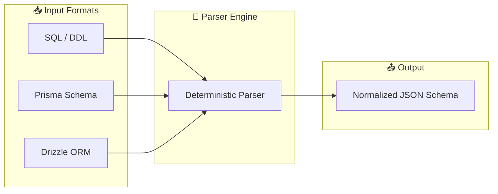
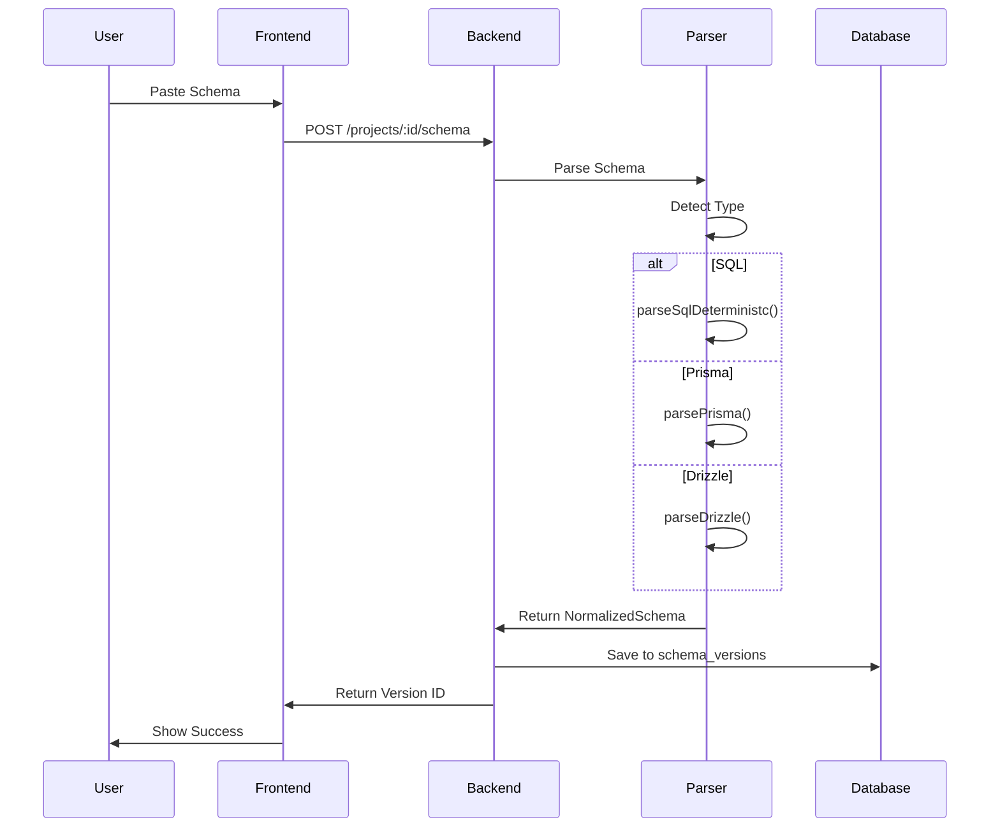

# 📝 Schema Input

> Parse and normalize database schemas from multiple formats

---

## 🎯 Purpose

The Schema Input feature allows users to paste or upload database schemas in various formats, which are then parsed and normalized into a unified JSON structure for visualization and analysis.

---

## 📊 Supported Schema Types



---

## 🔧 Technical Details

### Parser Location
- **File**: `server/parser.ts`
- **Functions**: 
  - `parseSqlDeterministc()` - SQL/DDL parsing
  - `parsePrisma()` - Prisma schema parsing
  - `parseDrizzle()` - Drizzle ORM parsing

### Normalized Schema Structure

```typescript
interface NormalizedSchema {
    tables: Record<string, NormalizedTable>;
}

interface NormalizedTable {
    columns: Record<string, NormalizedColumn>;
    relations: NormalizedRelation[];
    indexes: NormalizedIndex[];
}

interface NormalizedColumn {
    type: string;
    nullable?: boolean;
    primary?: boolean;
    unique?: boolean;
    default?: string;
    foreign_key?: string;
}

interface NormalizedRelation {
    type: 'one_to_one' | 'one_to_many' | 'many_to_one' | 'many_to_many';
    from: string;
    to: string;
}
```

---

## 📋 Example SQL Input

```sql
CREATE TABLE users (
    id UUID PRIMARY KEY DEFAULT gen_random_uuid(),
    email TEXT UNIQUE NOT NULL,
    name TEXT,
    created_at TIMESTAMP DEFAULT NOW()
);

CREATE TABLE posts (
    id UUID PRIMARY KEY DEFAULT gen_random_uuid(),
    title TEXT NOT NULL,
    content TEXT,
    author_id UUID REFERENCES users(id)
);
```

### Parsed Output

```json
{
  "tables": {
    "users": {
      "columns": {
        "id": { "type": "UUID", "primary": true },
        "email": { "type": "TEXT", "unique": true, "nullable": false },
        "name": { "type": "TEXT", "nullable": true },
        "created_at": { "type": "TIMESTAMP", "default": "NOW()" }
      },
      "relations": [],
      "indexes": []
    },
    "posts": {
      "columns": {
        "id": { "type": "UUID", "primary": true },
        "title": { "type": "TEXT", "nullable": false },
        "content": { "type": "TEXT", "nullable": true },
        "author_id": { "type": "UUID", "foreign_key": "users.id" }
      },
      "relations": [
        { "type": "many_to_one", "from": "author_id", "to": "users" }
      ],
      "indexes": []
    }
  }
}
```

---

## 🔄 Workflow



---

## ⚙️ API Endpoint

### `POST /projects/:id/schema`

**Request Body:**
```json
{
    "raw_schema": "CREATE TABLE users (...)",
    "schema_type": "sql" // or "prisma" or "drizzle"
}
```

**Response:**
```json
{
    "id": "uuid",
    "project_id": "uuid",
    "version": 1,
    "normalized_schema": {...},
    "created_at": "timestamp"
}
```

---

## 📁 Related Notes

- [[ER Diagram Generation]]
- [[Version History]]
- [[Schema Designer]]

---

#feature #schema #parser #core
