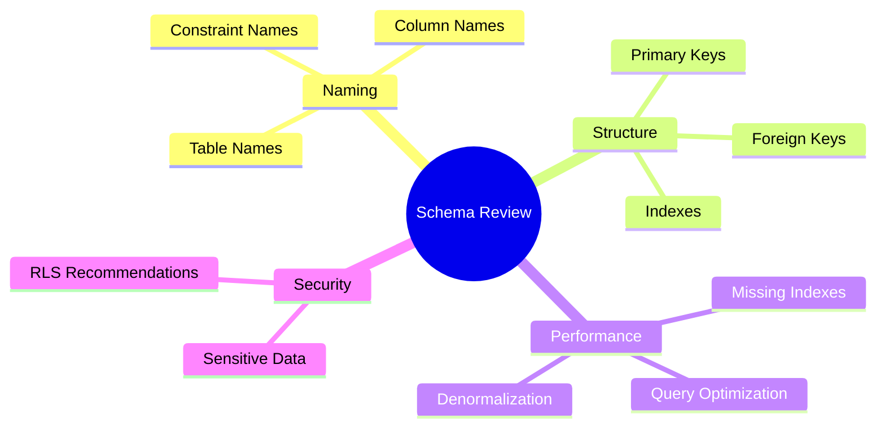
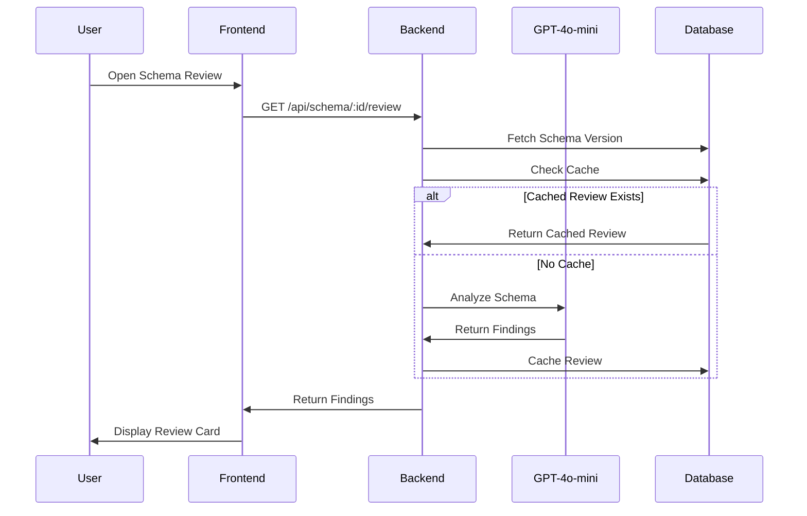
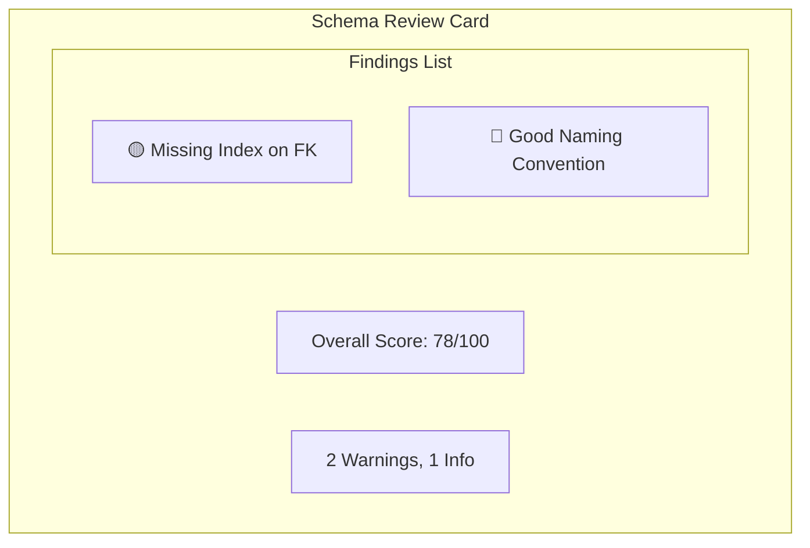

# 🔬 Schema Review

> AI-powered best practices analysis for database schemas

---

## 🎯 Purpose

Analyze your database schema against industry best practices and provide actionable recommendations for:
- Naming conventions
- Index optimization
- Relationship design
- Data integrity
- Performance considerations

---

## 📊 Review Categories



---

## 🔧 Technical Implementation

### Backend Route
- **File**: `server/src/routes/schemaReview.ts`
- **Endpoint**: `GET /api/schema/:projectId/review`

### Review Process



---

## 📋 Finding Types

| Severity | Icon | Description |
|----------|------|-------------|
| **Error** | 🔴 | Critical issues |
| **Warning** | 🟡 | Recommended changes |
| **Info** | 🔵 | Best practice suggestions |
| **Success** | 🟢 | Good practices detected |

---

## 💾 Database Schema

```sql
CREATE TABLE schema_reviews (
    id UUID PRIMARY KEY,
    project_id UUID REFERENCES projects(id),
    version_number INT NOT NULL,
    findings JSONB NOT NULL,
    created_at TIMESTAMPTZ,
    UNIQUE(project_id, version_number)
);
```

### Findings JSON Structure

```json
{
    "findings": [
        {
            "category": "naming",
            "severity": "warning",
            "title": "Inconsistent Table Naming",
            "description": "Table 'User' uses singular form...",
            "recommendation": "Use plural form: 'users'",
            "affected_entities": ["User"]
        }
    ],
    "score": 85,
    "summary": "Schema follows most best practices..."
}
```

---

## 📊 Review Criteria

### 1. Naming Conventions
- [ ] Table names: plural, snake_case
- [ ] Column names: snake_case
- [ ] Foreign keys: singular_id pattern
- [ ] Indexes: descriptive names

### 2. Primary Keys
- [ ] Every table has a primary key
- [ ] UUID or serial for IDs
- [ ] Composite keys documented

### 3. Foreign Keys
- [ ] All relationships have FK constraints
- [ ] ON DELETE behavior defined
- [ ] Indexes on FK columns

### 4. Indexes
- [ ] Indexes on frequently queried columns
- [ ] Composite indexes for common joins
- [ ] No over-indexing

---

## ⚙️ API Response Example

```json
{
    "findings": [
        {
            "category": "structure",
            "severity": "warning",
            "title": "Missing Index on Foreign Key",
            "description": "Column 'user_id' in 'posts' table is a foreign key but lacks an index.",
            "recommendation": "CREATE INDEX idx_posts_user_id ON posts(user_id);",
            "affected_entities": ["posts.user_id"]
        },
        {
            "category": "naming",
            "severity": "info",
            "title": "Good Naming Convention",
            "description": "All table names follow snake_case plural convention.",
            "affected_entities": []
        }
    ],
    "score": 78,
    "reviewed_at": "2024-01-14T12:00:00Z"
}
```

---

## 🖥️ Frontend Display



---

## 📁 Related Notes

- [[AI Explanations]]
- [[Best Practices]]
- [[Ask Schema]]

---

#feature #ai #review #intelligence
