# 👥 Team Collaboration

> Workspace-based team management with role-based access control

---

## 🎯 Purpose

Enable teams to collaborate on schema projects:
- Workspace-based organization
- Role-based access control
- Invite link system
- Activity logging

---

## 📊 Workspace Structure

```mermaid
graph TB
    subgraph Workspace["Workspace"]
        Owner["👑 Owner"]
        
        subgraph Members["Team Members"]
            Admin["🔧 Admin"]
            Editor["✏️ Editor"]
            Viewer["👁️ Viewer"]
        end
        
        subgraph Projects["Projects"]
            P1[Project 1]
            P2[Project 2]
            P3[Project 3]
        end
    end
    
    Owner --> Admin
    Owner --> Editor
    Owner --> Viewer
    Owner --> Projects
    Admin --> Projects
    Editor --> Projects
    Viewer -.-> Projects
```



---

## 🔐 Role Permissions

| Permission | Owner | Admin | Editor | Viewer |
|------------|-------|-------|--------|--------|
| View Projects | ✅ | ✅ | ✅ | ✅ |
| Create Projects | ✅ | ✅ | ❌ | ❌ |
| Edit Schema | ✅ | ✅ | ✅ | ❌ |
| Delete Projects | ✅ | ✅ | ❌ | ❌ |
| Invite Members | ✅ | ✅ | ❌ | ❌ |
| Manage Billing | ✅ | ❌ | ❌ | ❌ |
| Delete Workspace | ✅ | ❌ | ❌ | ❌ |

---

## 🔧 Technical Implementation

### Database Schema

```sql
-- Workspaces
CREATE TABLE workspaces (
    id UUID PRIMARY KEY,
    name TEXT NOT NULL,
    type TEXT CHECK (type IN ('personal', 'team')),
    owner_id UUID REFERENCES auth.users(id),
    created_at TIMESTAMPTZ
);

-- Workspace Members
CREATE TABLE workspace_members (
    id UUID PRIMARY KEY,
    workspace_id UUID REFERENCES workspaces(id),
    user_id UUID REFERENCES auth.users(id),
    role TEXT CHECK (role IN ('admin', 'editor', 'viewer', 'member')),
    created_at TIMESTAMPTZ,
    UNIQUE(workspace_id, user_id)
);

-- Workspace Invites
CREATE TABLE workspace_invites (
    id UUID PRIMARY KEY,
    workspace_id UUID REFERENCES workspaces(id),
    token TEXT NOT NULL,
    role TEXT CHECK (role IN ('admin', 'editor', 'viewer', 'member')),
    expires_at TIMESTAMPTZ NOT NULL,
    used_count INT DEFAULT 0,
    max_uses INT DEFAULT 50,
    revoked BOOLEAN DEFAULT FALSE,
    is_active BOOLEAN DEFAULT TRUE,
    created_by UUID REFERENCES auth.users(id)
);
```

---

## 🔗 Invite Flow


---

## 📋 Invite Link Structure

```
https://vizora.app/join/team?token=abc123xyz
```

### Token Validation

```typescript
// Validate invite token
const { data: invite } = await supabase
    .from('workspace_invites')
    .select('*')
    .eq('token', token)
    .eq('is_active', true)
    .eq('revoked', false)
    .gt('expires_at', new Date().toISOString())
    .single();

if (!invite) throw new Error('Invalid or expired invite');
if (invite.used_count >= invite.max_uses) throw new Error('Invite limit reached');
```

---

## ⚙️ API Endpoints

### Create Invite
`POST /api/team/invite`

```json
{
    "workspace_id": "uuid",
    "role": "editor",
    "expires_in_days": 7,
    "max_uses": 10
}
```

**Response:**
```json
{
    "token": "abc123xyz",
    "invite_url": "https://vizora.app/join/team?token=abc123xyz",
    "expires_at": "2024-01-21T12:00:00Z"
}
```

### Join Workspace
`POST /api/team/join`

```json
{
    "token": "abc123xyz"
}
```

### List Members
`GET /api/team/members/:workspaceId`

```json
{
    "members": [
        {
            "id": "uuid",
            "user_id": "uuid",
            "email": "user@example.com",
            "role": "admin",
            "joined_at": "2024-01-10T12:00:00Z"
        }
    ]
}
```

---

## 📊 Activity Logging

```sql
CREATE TABLE activity_logs (
    id UUID PRIMARY KEY,
    workspace_id UUID REFERENCES workspaces(id),
    user_id UUID REFERENCES auth.users(id),
    action TEXT NOT NULL,
    entity_type TEXT,  -- 'project', 'schema', 'team', etc.
    entity_id UUID,
    metadata JSONB,
    created_at TIMESTAMPTZ
);
```

---

## 📁 Related Notes

- [[Billing System]]
- [[Workspace Management]]
- [[User Roles]]

---

#feature #team #collaboration #workspace
