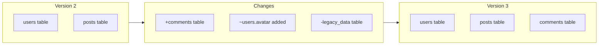

# 🔀 Version Compare

> Side-by-side comparison of schema versions with visual diff

---

## 🎯 Purpose

Compare two schema versions to understand what changed:
- Visual diff highlighting
- Added/removed tables
- Modified columns
- Changed relationships

---

## 📊 Comparison View



---

## 🔧 Technical Implementation

### Frontend Component
- **File**: `src/pages/VersionCompare.tsx`
- **Props**: `fromVersion`, `toVersion`

### API Endpoint
```http
GET /projects/:id/diff?from=2&to=3
```

### Response Structure
```typescript
interface DiffResponse {
    from_version: number;
    to_version: number;
    changes: ChangeObject[];
    summary: {
        tables_added: number;
        tables_removed: number;
        columns_added: number;
        columns_removed: number;
        columns_modified: number;
    };
}
```

---

## 🎨 Visual Indicators

| Symbol | Color | Meaning |
|--------|-------|---------|
| `+` | 🟢 Green | Added |
| `-` | 🔴 Red | Removed |
| `~` | 🟡 Yellow | Modified |

---

## 📁 Related Notes

- [[Change Tracking]]
- [[Version History]]
- [[Schema Input]]

---

#feature #versions #compare #diff
