# 📜 Version History

> Track schema evolution with immutable version snapshots

---

## 🎯 Purpose

Maintain a complete history of schema changes:
- Immutable version snapshots
- Version comparison
- Rollback capabilities
- Change tracking

---

## 📊 Version System


---

## 🔧 Technical Implementation

### Version Storage

```sql
CREATE TABLE schema_versions (
    id UUID PRIMARY KEY,
    project_id UUID REFERENCES projects(id),
    version INT NOT NULL DEFAULT 1,
    raw_schema TEXT NOT NULL,       -- Original input
    normalized_schema JSONB NOT NULL, -- Parsed structure
    schema_hash TEXT,               -- For duplicate detection
    created_at TIMESTAMPTZ
);

CREATE INDEX idx_schema_versions_lookup 
ON schema_versions(project_id, version DESC);
```

### Version Creation Flow


---

## 📋 Version Data

```typescript
interface SchemaVersion {
    id: string;
    project_id: string;
    version: number;
    raw_schema: string;
    normalized_schema: NormalizedSchema;
    schema_hash: string;
    created_at: string;
}
```

---

## 🔄 Version Workflow


---

## 🖥️ Frontend Display

```mermaid
graph TB
    subgraph VersionHistory["Version History Page"]
        Header["📜 Version History"]
        
        subgraph Timeline["Version Timeline"]
            V4["v4 - Current<br/>Jan 14, 2024"]
            V3["v3<br/>Jan 12, 2024"]
            V2["v2<br/>Jan 10, 2024"]
            V1["v1<br/>Jan 8, 2024"]
        end
        
        subgraph Actions["Version Actions"]
            View[View Schema]
            Compare[Compare Versions]
            Restore[Restore Version]
        end
    end
```



---

## ⚙️ API Endpoints

### Get Version History
`GET /projects/:id/versions`

```json
{
    "versions": [
        {
            "id": "uuid",
            "version": 4,
            "created_at": "2024-01-14T12:00:00Z",
            "change_count": 3
        },
        {
            "id": "uuid",
            "version": 3,
            "created_at": "2024-01-12T12:00:00Z",
            "change_count": 2
        }
    ]
}
```

### Get Specific Version
`GET /projects/:id/versions/:version`

```json
{
    "id": "uuid",
    "version": 3,
    "raw_schema": "CREATE TABLE...",
    "normalized_schema": {...},
    "created_at": "2024-01-12T12:00:00Z"
}
```

---

## 📊 Plan Limits

| Plan | Version Limit |
|------|---------------|
| **Free** | 2 per project |
| **Pro** | 30 per project |
| **Teams** | Unlimited |
| **Business** | Unlimited |

---

## 📁 Related Notes

- [[Change Tracking]]
- [[Version Compare]]
- [[Schema Input]]

---

#feature #versions #history #core
