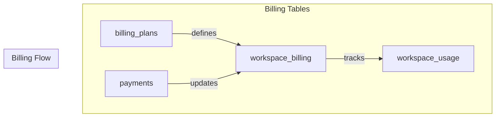
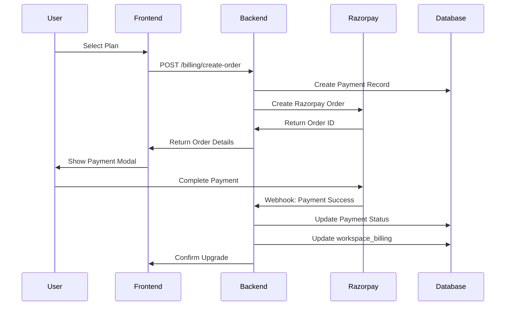

# 💳 Billing Tables

> Billing infrastructure: plans, subscriptions, and payments

---

## 📊 Billing Architecture



---

## 📋 billing_plans Table

Static plan definitions with limits and features.

```sql
CREATE TABLE billing_plans (
    id TEXT PRIMARY KEY,
    price_inr INT NOT NULL,
    project_limit INT NOT NULL,
    version_limit INT NOT NULL,      -- -1 for unlimited
    ai_limit INT DEFAULT -1,         -- -1 for unlimited
    validity_days INT NOT NULL DEFAULT 30,
    allow_exports BOOLEAN NOT NULL DEFAULT FALSE,
    allow_designer BOOLEAN NOT NULL DEFAULT FALSE,
    allow_team BOOLEAN NOT NULL DEFAULT FALSE,
    ai_level TEXT NOT NULL CHECK (ai_level IN ('none', 'db', 'table', 'full'))
);
```

### Plan Definitions

| Plan | Price (INR) | Projects | Versions | AI Level | Exports | Designer | Team |
|------|-------------|----------|----------|----------|---------|----------|------|
| **free** | ₹0 | 1 | 2 | db | ❌ | ❌ | ❌ |
| **pro** | ₹1,499 | 5 | 30 | table | ✅ | ✅ | ❌ |
| **teams** | ₹4,999 | 20 | ∞ | full | ✅ | ✅ | ✅ |
| **business** | ₹9,999 | ∞ | ∞ | full | ✅ | ✅ | ✅ |

---

## 📋 workspace_billing Table

Active subscription state per workspace.

```sql
CREATE TABLE workspace_billing (
    workspace_id UUID PRIMARY KEY REFERENCES workspaces(id),
    plan_id TEXT REFERENCES billing_plans(id) DEFAULT 'free',
    status TEXT CHECK (status IN ('active', 'expired')) DEFAULT 'active',
    start_at TIMESTAMPTZ DEFAULT NOW(),
    expires_at TIMESTAMPTZ,  -- NULL for free (never expires)
    last_payment_id UUID REFERENCES payments(id)
);
```

---

## 📋 workspace_usage Table

Usage counters for billing enforcement.

```sql
CREATE TABLE workspace_usage (
    workspace_id UUID PRIMARY KEY REFERENCES workspaces(id),
    projects_count INT DEFAULT 0,
    storage_bytes BIGINT DEFAULT 0,
    ai_tokens_used BIGINT DEFAULT 0,
    updated_at TIMESTAMPTZ DEFAULT NOW()
);
```

---

## 📋 payments Table

Payment transaction logs.

```sql
CREATE TABLE payments (
    id UUID PRIMARY KEY DEFAULT gen_random_uuid(),
    workspace_id UUID REFERENCES workspaces(id),
    plan_id TEXT REFERENCES billing_plans(id),
    razorpay_order_id TEXT,
    razorpay_payment_id TEXT,
    amount INT NOT NULL,
    status TEXT CHECK (status IN ('created', 'paid', 'failed')) DEFAULT 'created',
    created_at TIMESTAMPTZ DEFAULT NOW()
);
```

---

## 🔄 Billing Flow



---

## 📊 Active Plans View

```sql
CREATE OR REPLACE VIEW workspace_active_plans AS
SELECT 
    wb.workspace_id,
    CASE 
        WHEN wb.expires_at IS NULL THEN wb.plan_id
        WHEN wb.expires_at > NOW() THEN wb.plan_id
        ELSE 'free'
    END AS active_plan_id,
    wb.expires_at,
    CASE
        WHEN wb.expires_at IS NULL THEN FALSE
        WHEN wb.expires_at > NOW() THEN FALSE
        ELSE TRUE
    END AS is_expired,
    bp.*
FROM workspace_billing wb
JOIN billing_plans bp ON bp.id = (
    CASE 
        WHEN wb.expires_at IS NULL THEN wb.plan_id
        WHEN wb.expires_at > NOW() THEN wb.plan_id
        ELSE 'free'
    END
);
```

---

## 🔧 Billing Functions

### Check Project Limit
```typescript
async function checkProjectLimit(workspaceId: string) {
    const plan = await getWorkspacePlan(workspaceId);
    
    const { count } = await supabase
        .from('projects')
        .select('*', { count: 'exact', head: true })
        .eq('workspace_id', workspaceId);
    
    if (plan.project_limit !== -1 && count >= plan.project_limit) {
        return { allowed: false, message: 'Project limit reached' };
    }
    
    return { allowed: true };
}
```

### Check Feature Access
```typescript
async function checkFeatureAccess(workspaceId: string, feature: string) {
    const plan = await getWorkspacePlan(workspaceId);
    
    switch (feature) {
        case 'exports': return plan.allow_exports;
        case 'designer': return plan.allow_designer;
        case 'team': return plan.allow_team;
        default: return false;
    }
}
```

---

## 📁 Related Notes

- [[Database Schema Overview]]
- [[Billing System]]
- [[Workspaces Table]]

---

#database #table #billing #payments
