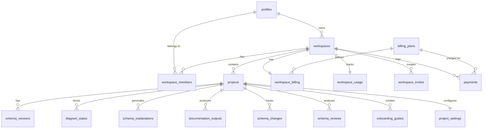
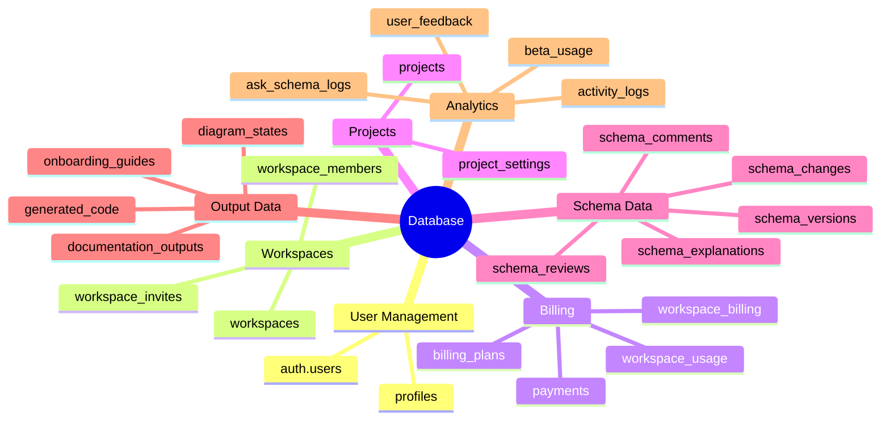

# 🗄️ Database Schema Overview

> Complete database schema documentation for the Vizora platform

---

## 📊 Entity Relationship Diagram



---

## 📁 Table Categories



---

## 📋 Table Index

| Table | Category | Description |
|-------|----------|-------------|
| [[Profiles Table]] | Users | User profiles extending auth.users |
| [[Workspaces Table]] | Workspaces | Organization containers |
| [[Workspace Members Table]] | Workspaces | User-workspace associations |
| [[Projects Table]] | Projects | Schema project containers |
| [[Schema Versions Table]] | Schema | Immutable version history |
| [[Billing Plans Table]] | Billing | Plan definitions |
| [[Workspace Billing Table]] | Billing | Active subscriptions |
| [[Payments Table]] | Billing | Transaction logs |

---

## 🔐 Row Level Security

All tables have RLS enabled with policies based on:
- User ownership
- Workspace membership
- Admin privileges

```sql
-- Example RLS Policy
CREATE POLICY "Projects - View workspace projects" ON projects 
FOR SELECT USING (
    public.is_member_of(workspace_id) OR 
    (SELECT owner_id FROM workspaces WHERE id = workspace_id) = auth.uid()
);
```

---

## 📁 Related Notes

- [[Profiles Table]]
- [[Workspaces Table]]
- [[Projects Table]]
- [[Billing System]]

---

#database #schema #overview
