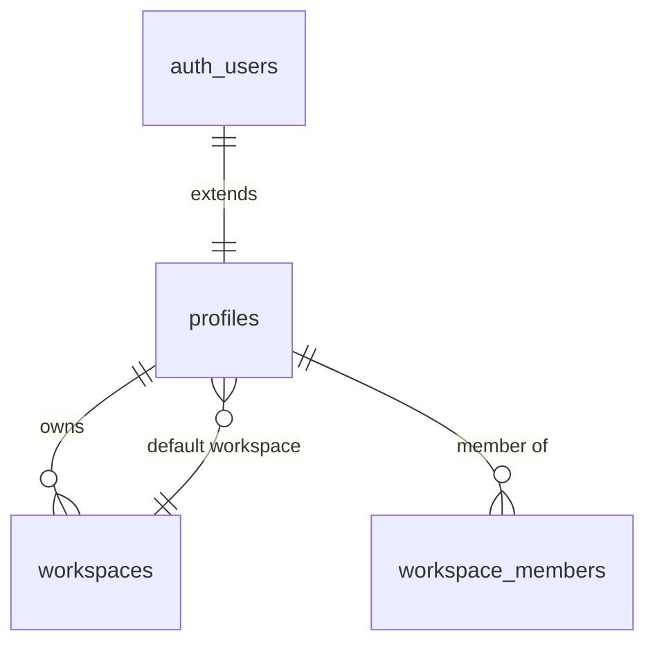

# 👤 Profiles Table

> User profile information extending Supabase auth.users

---

## 📋 Schema Definition

```sql
CREATE TABLE profiles (
    id UUID PRIMARY KEY REFERENCES auth.users(id) ON DELETE CASCADE,
    username TEXT UNIQUE,
    role_title TEXT,
    onboarded BOOLEAN DEFAULT FALSE,
    default_workspace_id UUID REFERENCES workspaces(id),
    created_at TIMESTAMP WITH TIME ZONE DEFAULT NOW(),
    updated_at TIMESTAMP WITH TIME ZONE DEFAULT NOW()
);
```

---

## 📊 Column Details

| Column | Type | Constraints | Description |
|--------|------|-------------|-------------|
| `id` | UUID | PK, FK → auth.users | User identifier (same as auth.users.id) |
| `username` | TEXT | UNIQUE | Display username |
| `role_title` | TEXT | - | Job title (e.g., "Backend Developer") |
| `onboarded` | BOOLEAN | DEFAULT FALSE | Onboarding completion flag |
| `default_workspace_id` | UUID | FK → workspaces | User's default workspace |
| `created_at` | TIMESTAMPTZ | DEFAULT NOW() | Creation timestamp |
| `updated_at` | TIMESTAMPTZ | DEFAULT NOW() | Last update timestamp |

---

## 🔗 Relationships



---

## 🔐 RLS Policies

```sql
-- View self only
CREATE POLICY "Profiles - View self" ON profiles 
FOR SELECT USING (id = auth.uid());

-- Update self only
CREATE POLICY "Profiles - Update self" ON profiles 
FOR UPDATE USING (id = auth.uid());

-- Insert self only
CREATE POLICY "Profiles - Insert self" ON profiles 
FOR INSERT WITH CHECK (id = auth.uid());
```

---

## 📝 Usage Examples

### Get Current User Profile
```typescript
const { data: profile } = await supabase
    .from('profiles')
    .select('*')
    .eq('id', user.id)
    .single();
```

### Update Profile
```typescript
await supabase
    .from('profiles')
    .update({ 
        username: 'new_username',
        role_title: 'Full Stack Developer'
    })
    .eq('id', user.id);
```

### Complete Onboarding
```typescript
await supabase
    .from('profiles')
    .update({ 
        onboarded: true,
        default_workspace_id: workspaceId
    })
    .eq('id', user.id);
```

---

## 📁 Related Notes

- [[Database Schema Overview]]
- [[Workspaces Table]]
- [[Authentication Flow]]

---

#database #table #users #profiles
