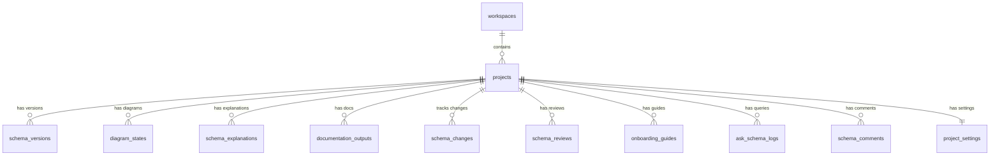
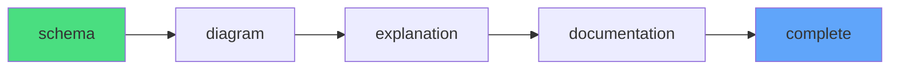

# 📦 Projects Table

> Schema project containers with workflow tracking

---

## 📋 Schema Definition

```sql
CREATE TABLE projects (
    id UUID PRIMARY KEY DEFAULT gen_random_uuid(),
    name TEXT NOT NULL,
    schema_type TEXT NOT NULL,  -- sql | prisma | drizzle
    current_step TEXT DEFAULT 'schema',
    workspace_id UUID REFERENCES workspaces(id) ON DELETE CASCADE,
    owner_id UUID REFERENCES auth.users(id),
    created_at TIMESTAMPTZ DEFAULT NOW()
);
```

---

## 📊 Column Details

| Column | Type | Constraints | Description |
|--------|------|-------------|-------------|
| `id` | UUID | PK | Unique project identifier |
| `name` | TEXT | NOT NULL | Project display name |
| `schema_type` | TEXT | NOT NULL | Schema format (sql/prisma/drizzle) |
| `current_step` | TEXT | DEFAULT 'schema' | Current workflow step |
| `workspace_id` | UUID | FK → workspaces | Parent workspace |
| `owner_id` | UUID | FK → auth.users | Project owner |
| `created_at` | TIMESTAMPTZ | DEFAULT NOW() | Creation timestamp |

---

## 🔗 Relationships



---

## 📊 Workflow Steps



| Step | Description |
|------|-------------|
| `schema` | Initial schema input |
| `diagram` | ER diagram generated |
| `explanation` | AI explanations ready |
| `documentation` | Docs generated |
| `complete` | All steps done |

---

## 🔐 RLS Policies

```sql
-- View workspace projects
CREATE POLICY "Projects - View workspace projects" ON projects 
FOR SELECT USING (
    public.is_member_of(workspace_id) OR 
    (SELECT owner_id FROM workspaces WHERE id = workspace_id) = auth.uid()
);

-- Create in workspace (admin/owner only)
CREATE POLICY "Projects - Create in workspace" ON projects 
FOR INSERT WITH CHECK (
    public.is_admin_of(workspace_id) OR 
    (SELECT owner_id FROM workspaces WHERE id = workspace_id) = auth.uid()
);
```

---

## 🔧 Triggers

### Handle New Project

```sql
CREATE OR REPLACE FUNCTION handle_new_project() 
RETURNS TRIGGER AS $$
BEGIN
    -- Initialize settings
    INSERT INTO project_settings (project_id) VALUES (NEW.id);
    
    -- Track Beta Usage
    PERFORM public.increment_beta_usage(NEW.owner_id, 'project');
    
    -- Update workspace usage counter
    UPDATE workspace_usage 
    SET projects_count = projects_count + 1, updated_at = NOW()
    WHERE workspace_id = NEW.workspace_id;
    
    RETURN NEW;
END;
$$;
```

### Beta Project Limit

```sql
CREATE OR REPLACE FUNCTION prevent_extra_projects()
RETURNS TRIGGER AS $$
BEGIN
    IF (SELECT COUNT(*) FROM projects WHERE owner_id = NEW.owner_id) >= 2 THEN
        RAISE EXCEPTION 'You can''t create more than 2 projects during the private beta.';
    END IF;
    RETURN NEW;
END;
$$;
```

---

## 📝 Usage Examples

### Create Project
```typescript
const { data: project } = await supabase
    .from('projects')
    .insert({
        name: 'E-Commerce Schema',
        schema_type: 'sql',
        workspace_id: workspaceId,
        owner_id: userId
    })
    .select()
    .single();
```

### Get Project with Latest Version
```typescript
const { data } = await supabase
    .from('projects')
    .select(`
        *,
        schema_versions(version, created_at)
    `)
    .eq('id', projectId)
    .order('schema_versions.version', { ascending: false })
    .limit(1, { foreignTable: 'schema_versions' })
    .single();
```

---

## 📁 Related Notes

- [[Database Schema Overview]]
- [[Schema Versions Table]]
- [[Workspaces Table]]

---

#database #table #projects
