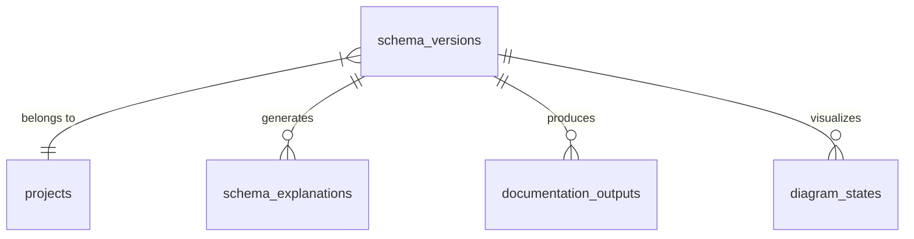
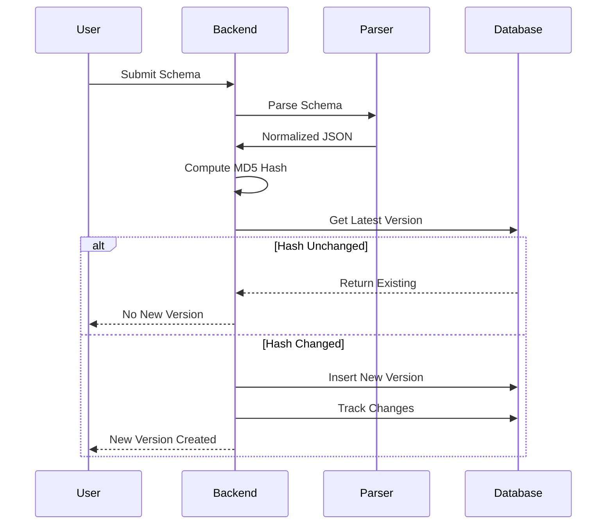

# 📜 Schema Versions Table

> Immutable version history for schema evolution tracking

---

## 📋 Schema Definition

```sql
CREATE TABLE schema_versions (
    id UUID PRIMARY KEY DEFAULT gen_random_uuid(),
    project_id UUID REFERENCES projects(id) ON DELETE CASCADE,
    version INT NOT NULL DEFAULT 1,
    raw_schema TEXT NOT NULL,
    normalized_schema JSONB NOT NULL,
    schema_hash TEXT,
    created_at TIMESTAMPTZ DEFAULT NOW()
);

CREATE INDEX idx_schema_versions_lookup 
ON schema_versions(project_id, version DESC);
```

---

## 📊 Column Details

| Column | Type | Constraints | Description |
|--------|------|-------------|-------------|
| `id` | UUID | PK | Unique version identifier |
| `project_id` | UUID | FK → projects | Parent project |
| `version` | INT | NOT NULL, DEFAULT 1 | Version number |
| `raw_schema` | TEXT | NOT NULL | Original schema input |
| `normalized_schema` | JSONB | NOT NULL | Parsed JSON structure |
| `schema_hash` | TEXT | - | MD5 hash for duplicate detection |
| `created_at` | TIMESTAMPTZ | DEFAULT NOW() | Creation timestamp |

---

## 🔗 Relationships



---

## 📊 Normalized Schema Structure

```json
{
    "tables": {
        "users": {
            "columns": {
                "id": {
                    "type": "UUID",
                    "primary": true,
                    "nullable": false
                },
                "email": {
                    "type": "TEXT",
                    "unique": true,
                    "nullable": false
                },
                "created_at": {
                    "type": "TIMESTAMPTZ",
                    "default": "NOW()"
                }
            },
            "relations": [
                {
                    "type": "one_to_many",
                    "from": "id",
                    "to": "posts"
                }
            ],
            "indexes": [
                {
                    "name": "idx_users_email",
                    "columns": ["email"],
                    "unique": true
                }
            ]
        }
    }
}
```

---

## 🔄 Version Creation Flow



---

## 🔐 RLS Policies

```sql
CREATE POLICY "Project Data Access" ON schema_versions 
FOR ALL USING (
    project_id IN (
        SELECT id FROM projects WHERE workspace_id IN (
            SELECT id FROM workspaces WHERE owner_id = auth.uid() 
            UNION 
            SELECT workspace_id FROM workspace_members WHERE user_id = auth.uid()
        )
    )
);
```

---

## 📝 Usage Examples

### Get Latest Version
```typescript
const { data: version } = await supabase
    .from('schema_versions')
    .select('*')
    .eq('project_id', projectId)
    .order('version', { ascending: false })
    .limit(1)
    .single();
```

### Create New Version
```typescript
const { data: newVersion } = await supabase
    .from('schema_versions')
    .insert({
        project_id: projectId,
        version: currentVersion + 1,
        raw_schema: rawSchema,
        normalized_schema: parsedSchema,
        schema_hash: computeHash(parsedSchema)
    })
    .select()
    .single();
```

### Get Version History
```typescript
const { data: versions } = await supabase
    .from('schema_versions')
    .select('id, version, created_at')
    .eq('project_id', projectId)
    .order('version', { ascending: false });
```

---

## 📁 Related Notes

- [[Database Schema Overview]]
- [[Projects Table]]
- [[Version History]]
- [[Change Tracking]]

---

#database #table #versions #schema
