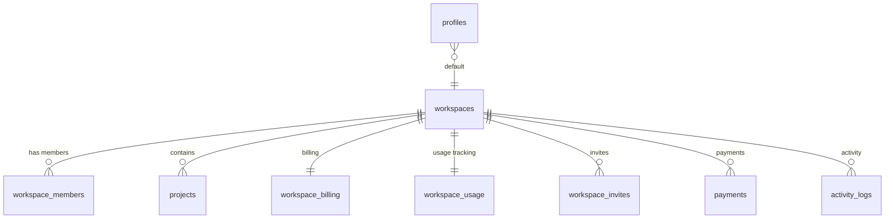
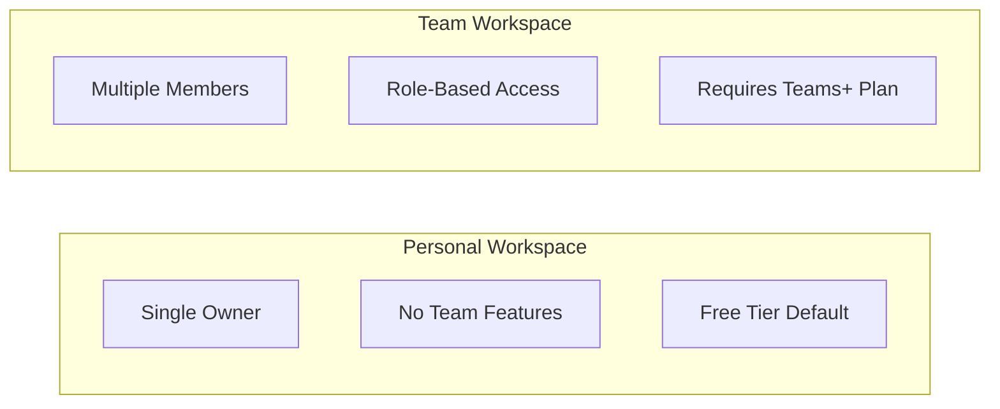

# 🏢 Workspaces Table

> Organization containers - personal or team workspaces

---

## 📋 Schema Definition

```sql
CREATE TABLE workspaces (
    id UUID PRIMARY KEY DEFAULT gen_random_uuid(),
    name TEXT NOT NULL,
    type TEXT NOT NULL CHECK (type IN ('personal', 'team')),
    owner_id UUID REFERENCES auth.users(id) ON DELETE CASCADE,
    created_at TIMESTAMP WITH TIME ZONE DEFAULT NOW(),
    updated_at TIMESTAMP WITH TIME ZONE DEFAULT NOW()
);
```

---

## 📊 Column Details

| Column | Type | Constraints | Description |
|--------|------|-------------|-------------|
| `id` | UUID | PK | Unique workspace identifier |
| `name` | TEXT | NOT NULL | Workspace display name |
| `type` | TEXT | CHECK | 'personal' or 'team' |
| `owner_id` | UUID | FK → auth.users | Workspace owner |
| `created_at` | TIMESTAMPTZ | DEFAULT NOW() | Creation timestamp |
| `updated_at` | TIMESTAMPTZ | DEFAULT NOW() | Last update timestamp |

---

## 🔗 Relationships



---

## 📊 Workspace Types



---

## 🔐 RLS Policies

```sql
-- View if owner or member
CREATE POLICY "Workspaces - View owned or member" ON workspaces 
FOR SELECT USING (
    owner_id = auth.uid() OR public.is_member_of(id)
);

-- Create own
CREATE POLICY "Workspaces - Create own" ON workspaces 
FOR INSERT WITH CHECK (owner_id = auth.uid());

-- Update if owner or admin
CREATE POLICY "Workspaces - Update own" ON workspaces 
FOR UPDATE USING (
    owner_id = auth.uid() OR public.is_admin_of(id)
);
```

---

## 🔧 Triggers

### Auto-Initialize Billing & Usage

```sql
CREATE OR REPLACE FUNCTION handle_new_workspace_billing()
RETURNS TRIGGER AS $$
BEGIN
    -- Initialize free plan billing
    INSERT INTO workspace_billing (workspace_id, plan_id, start_at, expires_at) 
    VALUES (NEW.id, 'free', NOW(), NULL);
    
    -- Initialize usage counter
    INSERT INTO workspace_usage (workspace_id) 
    VALUES (NEW.id);
    
    RETURN NEW;
END;
$$ LANGUAGE plpgsql;

CREATE TRIGGER tr_init_workspace_billing
AFTER INSERT ON workspaces
FOR EACH ROW EXECUTE FUNCTION handle_new_workspace_billing();
```

---

## 📝 Usage Examples

### Create Personal Workspace
```typescript
const { data: workspace } = await supabase
    .from('workspaces')
    .insert({
        name: 'My Workspace',
        type: 'personal',
        owner_id: user.id
    })
    .select()
    .single();
```

### Get User's Workspaces
```typescript
const { data: workspaces } = await supabase
    .from('workspaces')
    .select(`
        *,
        workspace_billing(plan_id, status),
        workspace_members(count)
    `)
    .or(`owner_id.eq.${userId},workspace_members.user_id.eq.${userId}`);
```

---

## 📁 Related Notes

- [[Database Schema Overview]]
- [[Workspace Members Table]]
- [[Workspace Billing Table]]
- [[Team Collaboration]]

---

#database #table #workspaces
