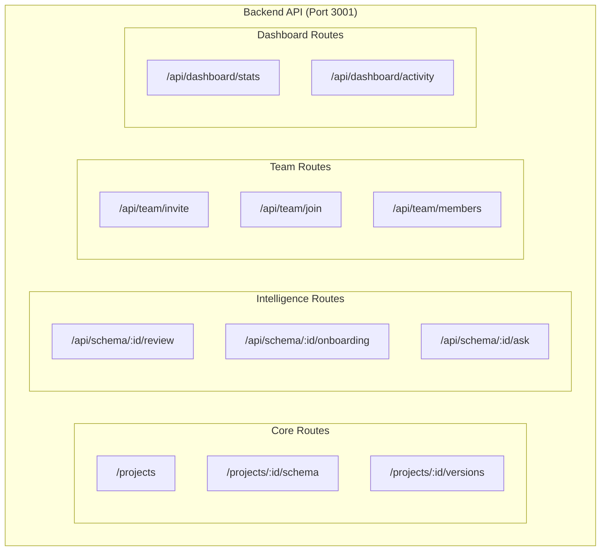

# 🔌 API Reference

> Complete backend API endpoint documentation

---

## 📊 API Overview



---

## 📋 Endpoint Index

| Endpoint | Method | Description |
|----------|--------|-------------|
| [[#Projects]] | POST/GET | Project management |
| [[#Schema]] | POST/GET | Schema operations |
| [[#Versions]] | GET | Version history |
| [[#Explanations]] | POST/GET | AI explanations |
| [[#Documentation]] | POST/GET | Auto docs |
| [[#Intelligence]] | GET/POST | AI features |
| [[#Team]] | POST/GET | Team management |
| [[#Billing]] | POST | Payment operations |

---

## 📁 Core Routes

### Projects

#### Create Project
```http
POST /projects
Content-Type: application/json

{
    "name": "My Project",
    "schema_type": "sql",
    "workspace_id": "uuid",
    "user_id": "uuid"
}
```

**Response:**
```json
{
    "id": "uuid",
    "name": "My Project",
    "schema_type": "sql",
    "workspace_id": "uuid",
    "created_at": "2024-01-14T12:00:00Z"
}
```

#### Get Projects
```http
GET /projects?workspace_id=uuid
```

---

### Schema

#### Submit Schema
```http
POST /projects/:id/schema
Content-Type: application/json

{
    "raw_schema": "CREATE TABLE users (...)",
    "schema_type": "sql"
}
```

**Response:**
```json
{
    "id": "uuid",
    "version": 1,
    "normalized_schema": {...},
    "changes": []
}
```

#### Get Latest Schema
```http
GET /projects/:id/schema
```

---

### Versions

#### Get Version History
```http
GET /projects/:id/versions
```

**Response:**
```json
{
    "versions": [
        { "version": 3, "created_at": "2024-01-14T12:00:00Z" },
        { "version": 2, "created_at": "2024-01-12T12:00:00Z" },
        { "version": 1, "created_at": "2024-01-10T12:00:00Z" }
    ]
}
```

#### Get Version Diff
```http
GET /projects/:id/diff?from=2&to=3
```

---

### Explanations

#### Generate Explanations
```http
POST /projects/:id/explanations
Content-Type: application/json

{
    "version_number": 1,
    "mode": "developer"
}
```

#### Get Explanations
```http
GET /projects/:id/explanations?version=1
```

---

### Documentation

#### Generate Docs
```http
POST /projects/:id/docs
Content-Type: application/json

{
    "version_number": 1
}
```

#### Get Docs
```http
GET /projects/:id/docs?version=1
```

**Response:**
```json
{
    "markdown": "# Database Documentation...",
    "pdf_url": "https://storage.../docs.pdf"
}
```

---

## 🤖 Intelligence Routes

### Schema Review
```http
GET /api/schema/:projectId/review?version=1
```

**Response:**
```json
{
    "findings": [
        {
            "category": "naming",
            "severity": "warning",
            "title": "Inconsistent Naming",
            "description": "...",
            "recommendation": "..."
        }
    ],
    "score": 85
}
```

### Onboarding Guide
```http
GET /api/schema/:projectId/onboarding?version=1
```

**Response:**
```json
{
    "content": "# 🚀 Database Onboarding Guide...",
    "cached": true
}
```

### Ask Schema
```http
POST /api/schema/:projectId/ask
Content-Type: application/json

{
    "question": "How are users and posts related?",
    "version_number": 1
}
```

**Response:**
```json
{
    "answer": "Users and posts are related through...",
    "referenced_tables": ["users", "posts"]
}
```

---

## 👥 Team Routes

### Create Invite Link
```http
POST /api/team/invite
Content-Type: application/json

{
    "workspace_id": "uuid",
    "role": "editor",
    "expires_in_days": 7,
    "max_uses": 10
}
```

**Response:**
```json
{
    "token": "abc123",
    "invite_url": "https://vizora.app/join/team?token=abc123",
    "expires_at": "2024-01-21T12:00:00Z"
}
```

### Join Workspace
```http
POST /api/team/join
Content-Type: application/json

{
    "token": "abc123"
}
```

### Get Members
```http
GET /api/team/members/:workspaceId
```

---

## 💳 Billing Routes

### Create Payment Order
```http
POST /billing/create-order
Content-Type: application/json

{
    "workspace_id": "uuid",
    "plan_id": "pro"
}
```

### Verify Payment
```http
POST /billing/verify
Content-Type: application/json

{
    "razorpay_order_id": "order_xxx",
    "razorpay_payment_id": "pay_xxx",
    "razorpay_signature": "..."
}
```

---

## 🔧 Helper Endpoints

### Health Check
```http
GET /
GET /health
```

### Beta Config
```http
GET /beta/config
```

**Response:**
```json
{
    "beta_mode": true,
    "project_limit": 2,
    "version_limit": 4,
    "label": "Private Beta"
}
```

---

## 🔐 Authentication

All endpoints (except public routes) require a valid Supabase auth token:

```http
Authorization: Bearer <supabase_access_token>
```

---

## 📁 Related Notes

- [[System Architecture]]
- [[Backend Services]]
- [[Database Schema Overview]]

---

#api #backend #reference #endpoints
