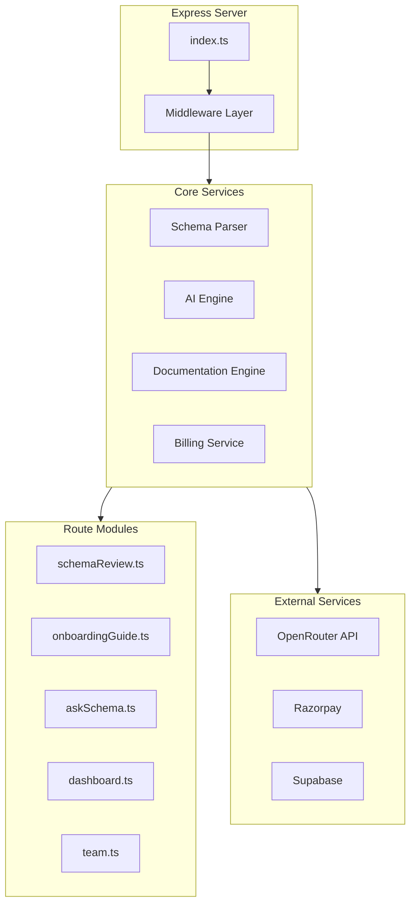
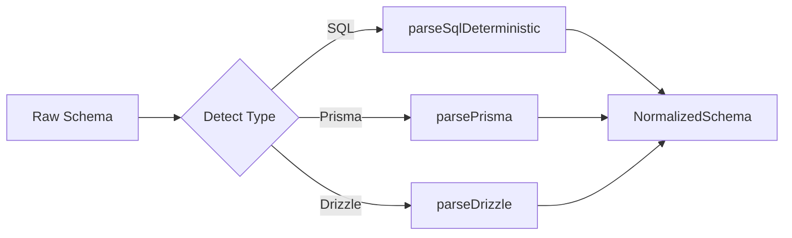
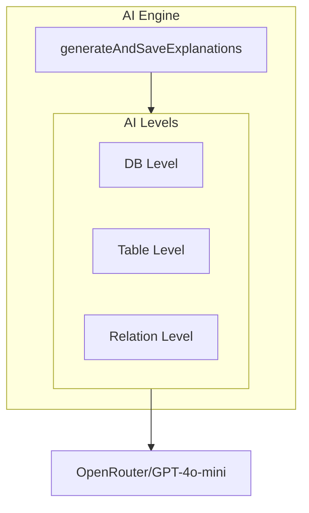
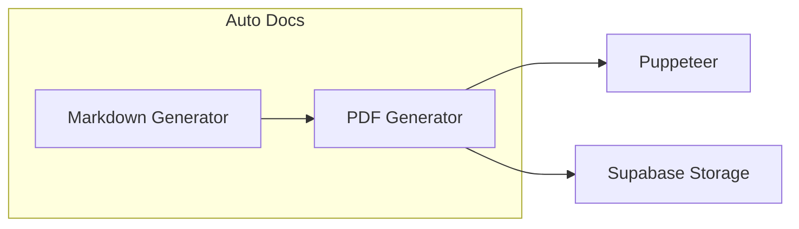

# ⚙️ Backend Services

> Backend service architecture and implementation details

---

## 📊 Service Architecture



---

## 📁 File Structure

```
server/
├── index.ts           # Main Express server (1957 lines)
├── parser.ts          # Schema parsing engine (710 lines)
├── billing.ts         # Billing logic (161 lines)
├── razorpay.ts        # Payment integration (7594 bytes)
└── src/
    └── routes/
        ├── schemaReview.ts
        ├── onboardingGuide.ts
        ├── askSchema.ts
        ├── dashboard.ts
        └── team.ts
```

---

## 🔧 Core Services

### 1. Schema Parser



**Key Functions:**
- `parseSqlDeterministc()` - Parse SQL DDL
- `parsePrisma()` - Parse Prisma schema
- `parseDrizzle()` - Parse Drizzle ORM
- `generateSql()` - Generate SQL from normalized
- `generatePrisma()` - Generate Prisma from normalized
- `compareSchemas()` - Diff two versions

### 2. AI Engine



**Configuration:**
- Model: `openai/gpt-4o-mini`
- Temperature: `0.2`
- Provider: OpenRouter

### 3. Documentation Engine



---

## 🔒 Middleware

### Project Context Middleware

```typescript
const requireProjectContext = async (req, res, next) => {
    const projectId = req.params.id;
    
    if (!projectId) {
        return res.status(400).json({
            error: "Project context required"
        });
    }
    
    // Verify project exists
    const { data: project, error } = await supabase
        .from('projects')
        .select('id')
        .eq('id', projectId)
        .single();
    
    if (error || !project) {
        return res.status(404).json({
            error: "Project not found"
        });
    }
    
    next();
};
```

### Request Logging

```typescript
app.use((req, res, next) => {
    console.log(`[${new Date().toISOString()}] ${req.method} ${req.url}`);
    if (req.body && Object.keys(req.body).length > 0) {
        console.log(`[Request Body Keys]: ${Object.keys(req.body).join(', ')}`);
    }
    next();
});
```

---

## 📡 External Integrations

### OpenRouter/OpenAI

```typescript
const openai = new OpenAI({
    baseURL: 'https://openrouter.ai/api/v1',
    apiKey: process.env.OPENROUTER_API_KEY,
    defaultHeaders: {
        "HTTP-Referer": process.env.SITE_URL || "https://vizora.app",
        "X-Title": "Vizora Schema Intelligence",
    },
});
```

### Supabase

```typescript
const supabase = createClient(supabaseUrl, supabaseKey);

// Storage bucket initialization
supabase.storage.createBucket('documentation', { public: true })
    .then(() => console.log("[Storage] 'documentation' bucket ensured"))
    .catch((err) => console.warn("[Storage] Bucket warning:", err.message));
```

---

## 🔔 Beta Configuration

```typescript
const BETA_MODE = true;
const BETA_PROJECT_LIMIT = 2;
const BETA_VERSION_LIMIT = 4;
const BETA_LABEL = "Private Beta";
```

### Beta Usage Tracking

```typescript
async function trackBetaUsage(userId, action) {
    if (!BETA_MODE || !userId) return;
    await supabase.rpc('increment_beta_usage', { 
        u_id: userId, 
        field: action  // 'project' | 'version' | 'diagram' | 'docs'
    });
}
```

---

## 📁 Related Notes

- [[API Reference]]
- [[System Architecture]]
- [[Database Schema Overview]]

---

#backend #services #architecture
