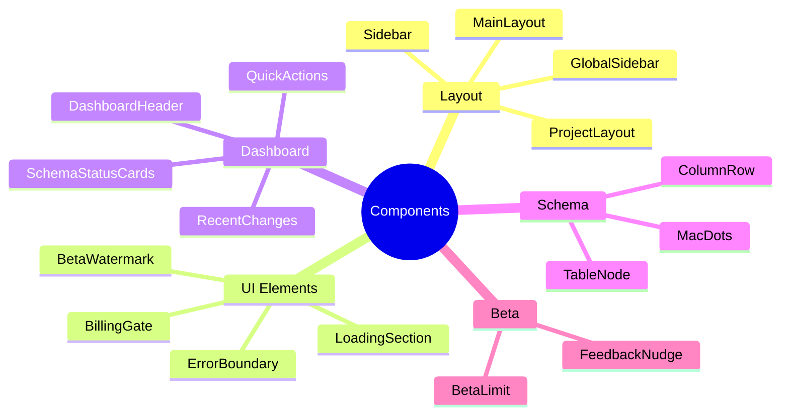

# 🎨 Component Library

> Reusable UI components in the Vizora frontend

---

## 📊 Component Overview



---

## 📁 Component Index

### Layout Components

| Component | File | Description |
|-----------|------|-------------|
| **MainLayout** | `layouts/MainLayout.tsx` | Global app wrapper with sidebar |
| **ProjectLayout** | `layouts/ProjectLayout.tsx` | Project workspace wrapper |
| **GlobalSidebar** | `components/GlobalSidebar.tsx` | Main navigation sidebar |
| **Sidebar** | `components/Sidebar.tsx` | Project-level sidebar |

### Core Components

| Component | File | Description |
|-----------|------|-------------|
| **BetaWatermark** | `components/BetaWatermark.tsx` | Corner beta labels |
| **BillingGate** | `components/BillingGate.tsx` | Feature access control |
| **LoadingSection** | `components/LoadingSection.tsx` | Loading states |
| **ErrorBoundary** | `components/ErrorBoundary.tsx` | Error handling |

### Dashboard Components

| Component | File | Description |
|-----------|------|-------------|
| **DashboardHeader** | `dashboard/DashboardHeader.tsx` | Dashboard title section |
| **QuickActions** | `dashboard/QuickActions.tsx` | Action buttons |
| **SchemaStatusCards** | `dashboard/SchemaStatusCards.tsx` | Status overview |
| **RecentChanges** | `dashboard/RecentChanges.tsx` | Activity feed |
| **DocumentationStatus** | `dashboard/DocumentationStatus.tsx` | Docs status |
| **VersionTimeline** | `dashboard/VersionTimeline.tsx` | Version history |

---

## 🔧 Key Component Details

### BillingGate

```tsx
interface BillingGateProps {
    feature: 'exports' | 'designer' | 'team';
    children: React.ReactNode;
    fallback?: React.ReactNode;
}

function BillingGate({ feature, children, fallback }) {
    const { hasAccess, loading } = useFeatureAccess(feature);
    
    if (loading) return <LoadingSection />;
    if (!hasAccess) return fallback || <UpgradePrompt />;
    
    return <>{children}</>;
}
```

### TableNode (ReactFlow)

```tsx
interface TableNodeProps {
    id: string;
    data: {
        tableName: string;
        columns: Column[];
    };
    selected: boolean;
}

function TableNode({ id, data, selected }: NodeProps) {
    return (
        <div className={`table-node ${selected ? 'ring-2' : ''}`}>
            <Handle type="target" position={Position.Left} />
            <div className="table-header">{data.tableName}</div>
            <div className="columns">
                {data.columns.map(col => (
                    <ColumnRow key={col.name} column={col} />
                ))}
            </div>
            <Handle type="source" position={Position.Right} />
        </div>
    );
}
```

### FeedbackNudge (Beta)

```tsx
function FeedbackNudge({ context }) {
    const [rating, setRating] = useState(0);
    const [submitted, setSubmitted] = useState(false);
    
    const handleSubmit = async () => {
        await api.post('/feedback/submit', {
            user_id: userId,
            context,
            rating
        });
        setSubmitted(true);
    };
    
    if (submitted) return <ThankYouMessage />;
    
    return (
        <div className="feedback-nudge">
            <StarRating value={rating} onChange={setRating} />
            <button onClick={handleSubmit}>Submit Feedback</button>
        </div>
    );
}
```

---

## 🎨 Styling Patterns

### Tailwind Utilities

```tsx
// Card styling
<div className="bg-white rounded-xl shadow-sm border border-gray-200 p-6">

// Button styling
<button className="bg-indigo-600 hover:bg-indigo-700 text-white px-4 py-2 rounded-lg">

// Table node styling
<div className="bg-white border border-gray-300 rounded-lg shadow-md">
```

### Component Variants

```tsx
// Loading states
<LoadingSection size="sm" />
<LoadingSection size="md" />
<LoadingSection size="lg" />

// Button variants
<Button variant="primary">Save</Button>
<Button variant="secondary">Cancel</Button>
<Button variant="danger">Delete</Button>
```

---

## 📁 Related Notes

- [[Frontend Structure]]
- [[System Architecture]]

---

#components #frontend #ui #react
