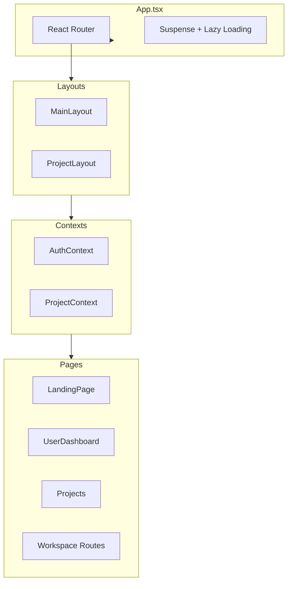
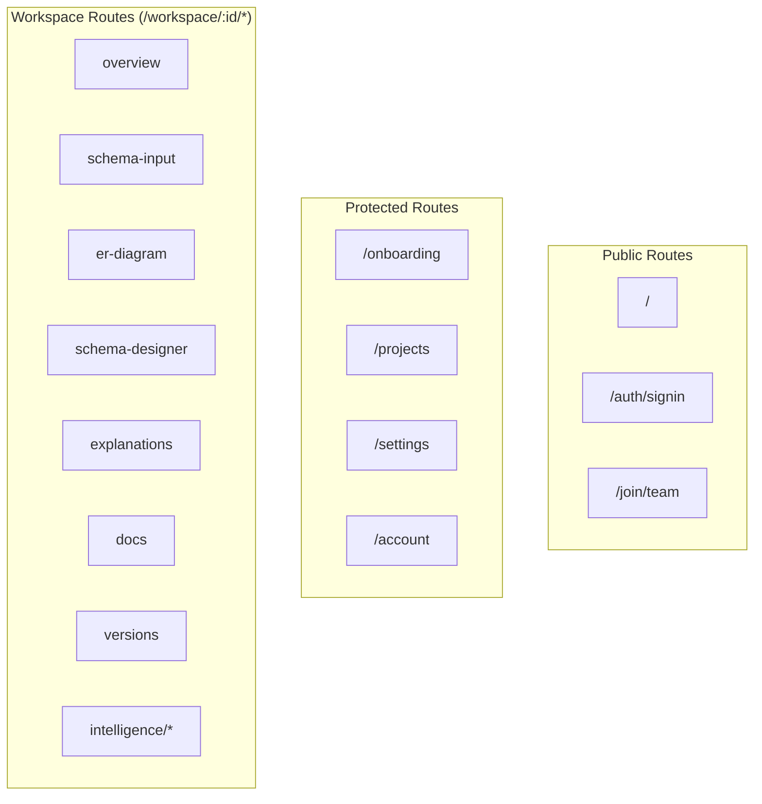
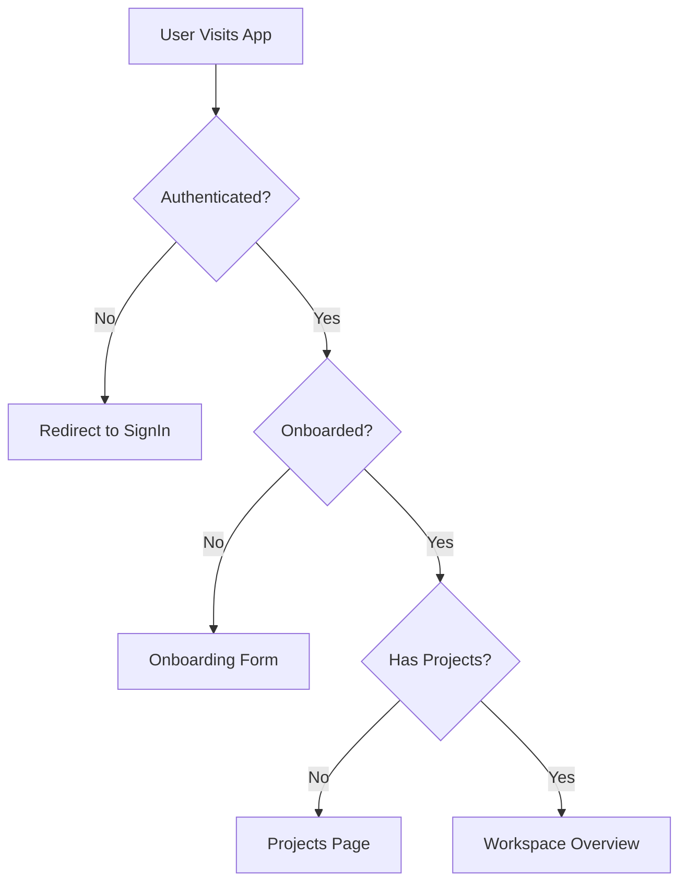

# 🖥️ Frontend Structure

> React frontend architecture and component organization

---

## 📊 Component Architecture



---

## 📁 Directory Structure

```
src/
├── App.tsx                    # Main app with routes
├── main.tsx                   # Entry point
├── index.css                  # Global styles
│
├── components/                # Reusable components
│   ├── dashboard/             # Dashboard widgets
│   │   ├── DashboardHeader.tsx
│   │   ├── SchemaStatusCards.tsx
│   │   ├── QuickActions.tsx
│   │   └── RecentChanges.tsx
│   ├── beta/                  # Beta features
│   │   └── FeedbackNudge.tsx
│   ├── schema-designer/       # Designer components
│   ├── user-dashboard/        # Account components
│   ├── GlobalSidebar.tsx
│   ├── Sidebar.tsx
│   └── BetaWatermark.tsx
│
├── pages/                     # Page components
│   ├── LandingPage.tsx
│   ├── UserDashboard.tsx
│   ├── Projects.tsx
│   ├── ERDiagrams.tsx
│   ├── SchemaDesigner.tsx
│   ├── AiExplanations.tsx
│   ├── AutoDocs.tsx
│   ├── Intelligence/          # AI features
│   │   ├── SchemaReview.tsx
│   │   ├── OnboardingGuide.tsx
│   │   └── AskSchema.tsx
│   └── auth/
│       └── SignInPage.tsx
│
├── layouts/                   # Layout wrappers
│   ├── MainLayout.tsx
│   └── ProjectLayout.tsx
│
├── context/                   # React contexts
│   ├── AuthContext.tsx
│   └── ProjectContext.tsx
│
├── hooks/                     # Custom hooks
│   └── useProject.ts
│
└── lib/                       # Utilities
    ├── supabase.ts
    ├── api.ts
    └── generators.ts
```

---

## 🛣️ Route Structure



---

## 🔐 Authentication Flow



### AuthGuard Component

```tsx
function AuthGuard({ children }) {
    const { user, loading } = useAuth();
    
    if (loading) return <Spinner />;
    if (!user) return <Navigate to="/" />;
    
    return <>{children}</>;
}
```

---

## 🧩 Key Components

### GlobalSidebar
- Navigation for main app
- Projects list
- Quick actions
- User menu

### Sidebar (Project)
- Project-specific navigation
- Schema steps
- Intelligence features
- Settings access

### BillingGate
```tsx
<BillingGate feature="designer">
    <SchemaDesigner />
</BillingGate>
```

### BetaWatermark
```tsx
// Shows "Vizora Beta" in corners
<BetaWatermark />
```

---

## 🎨 Styling

### Technologies
- **TailwindCSS** - Utility-first CSS
- **Custom CSS** - `index.css` for global styles
- **Component styles** - Inline Tailwind classes

### Design System
```css
/* Color tokens from tailwind.config.js */
colors: {
    primary: '#4f46e5',    /* Indigo */
    secondary: '#0ea5e9',  /* Sky */
    accent: '#8b5cf6',     /* Violet */
}
```

---

## 📦 State Management

### Context Providers

```tsx
// AuthContext - User authentication state
const { user, loading, signOut } = useAuth();

// ProjectContext - Current project state
const { project, version, loading } = useProjectContext();
```

### Local State
- Component-level `useState`
- Form state with controlled inputs
- Loading/error states

---

## 🔄 Data Fetching

### Supabase Client
```typescript
import { supabase } from '../lib/supabase';

// Query example
const { data, error } = await supabase
    .from('projects')
    .select('*')
    .eq('workspace_id', workspaceId);
```

### Backend API
```typescript
import { api } from '../lib/api';

// API call example
const response = await api.post(`/projects/${id}/schema`, {
    raw_schema: schema,
    schema_type: 'sql'
});
```

---

## 📁 Related Notes

- [[System Architecture]]
- [[Component Library]]
- [[Feature Index]]

---

#frontend #react #architecture #components
