# 💰 Billing System

> Complete billing architecture with Razorpay integration

---

## 📊 Billing Overview

```mermaid
graph TB
    subgraph Plans["Billing Plans"]
        Free["🆓 Free"]
        Pro["⭐ Pro"]
        Teams["👥 Teams"]
        Business["🏢 Business"]
    end
    
    subgraph Flow["Payment Flow"]
        Select[Select Plan]
        Pay[Razorpay Checkout]
        Verify[Verify Payment]
        Activate[Activate Plan]
    end
    
    subgraph Access["Feature Gating"]
        Projects[Project Limits]
        Versions[Version Limits]
        Features[Feature Access]
        AI[AI Level]
    end
    
    Plans --> Flow
    Flow --> Access
```



---

## 💳 Pricing Structure

| Feature | Free | Pro | Teams | Business |
|---------|------|-----|-------|----------|
| **Price** | ₹0 | ₹1,499/mo | ₹4,999/mo | ₹9,999/mo |
| **Projects** | 1 | 5 | 20 | Unlimited |
| **Versions** | 2 | 30 | Unlimited | Unlimited |
| **AI Level** | DB only | DB + Tables | Full | Full |
| **Exports** | ❌ | ✅ | ✅ | ✅ |
| **Designer** | ❌ | ✅ | ✅ | ✅ |
| **Team** | ❌ | ❌ | ✅ | ✅ |
| **White-Label** | ❌ | ❌ | ❌ | ✅ |

---

## 🔧 Technical Implementation

### Backend Files
- `server/billing.ts` - Core billing logic
- `server/razorpay.ts` - Payment integration

### Key Functions

```typescript
// Get workspace's active plan
async function getWorkspacePlan(workspaceId: string): Promise<BillingPlan>

// Check project creation limit
async function checkProjectLimit(workspaceId: string): Promise<{allowed: boolean}>

// Check version creation limit
async function checkVersionLimit(workspaceId: string, projectId: string)

// Check feature access (exports, designer, team)
async function checkFeatureAccess(workspaceId: string, feature: string)

// Get AI access level
async function getAiAccessLevel(workspaceId: string): Promise<'none'|'db'|'table'|'full'>
```

---

## 🔄 Payment Flow


---

## 🔐 Billing Gate Component

```tsx
// Frontend component for feature gating
function BillingGate({ feature, children, fallback }) {
    const { plan, loading } = useWorkspacePlan();
    
    if (loading) return <Spinner />;
    
    const hasAccess = checkAccess(plan, feature);
    
    if (!hasAccess) {
        return fallback || <UpgradePrompt feature={feature} />;
    }
    
    return children;
}

// Usage
<BillingGate feature="designer">
    <SchemaDesigner />
</BillingGate>
```

---

## 📊 AI Level Access

```mermaid
graph LR
    subgraph Levels["AI Levels"]
        None["none<br/>No AI"]
        DB["db<br/>DB Summary Only"]
        Table["table<br/>DB + Tables"]
        Full["full<br/>All Levels"]
    end
    
    subgraph Plans["Plan Mapping"]
        Free2["Free → db"]
        Pro2["Pro → table"]
        Teams2["Teams → full"]
        Biz2["Business → full"]
    end
```



---

## 💾 Database Schema

```sql
-- Plan definitions
CREATE TABLE billing_plans (
    id TEXT PRIMARY KEY,
    price_inr INT NOT NULL,
    project_limit INT NOT NULL,
    version_limit INT NOT NULL,
    ai_level TEXT CHECK (ai_level IN ('none', 'db', 'table', 'full'))
);

-- Workspace subscription
CREATE TABLE workspace_billing (
    workspace_id UUID PRIMARY KEY,
    plan_id TEXT REFERENCES billing_plans(id),
    status TEXT CHECK (status IN ('active', 'expired')),
    expires_at TIMESTAMPTZ
);

-- Payment logs
CREATE TABLE payments (
    id UUID PRIMARY KEY,
    workspace_id UUID,
    plan_id TEXT,
    razorpay_order_id TEXT,
    razorpay_payment_id TEXT,
    amount INT NOT NULL,
    status TEXT CHECK (status IN ('created', 'paid', 'failed'))
);
```

---

## ⚙️ API Endpoints

### Create Order
```http
POST /billing/create-order
{
    "workspace_id": "uuid",
    "plan_id": "pro"
}
```

### Verify Payment
```http
POST /billing/verify
{
    "razorpay_order_id": "order_xxx",
    "razorpay_payment_id": "pay_xxx",
    "razorpay_signature": "..."
}
```

### Get Plan Status
```http
GET /billing/status/:workspaceId
```

---

## 🔔 Beta Mode Override

During beta, billing limits are disabled:

```typescript
// In billing.ts
export async function checkProjectLimit(workspaceId: string) {
    // BETA OVERRIDE: Disable billing limits during beta
    return { allowed: true };
}

export async function checkFeatureAccess(workspaceId: string, feature: string) {
    return true; // Beta Override: Enable all features
}

export async function getAiAccessLevel(workspaceId: string) {
    return 'full'; // Beta Override: Give full AI access
}
```

---

## 📁 Related Notes

- [[Billing Tables]]
- [[Database Schema Overview]]
- [[Feature Index]]

---

#billing #payments #razorpay #plans
