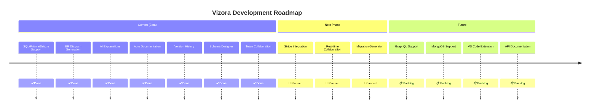
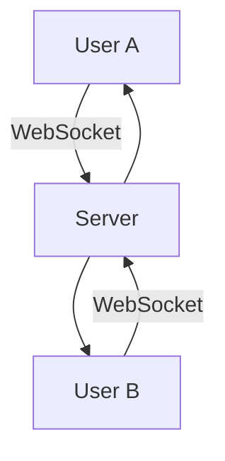
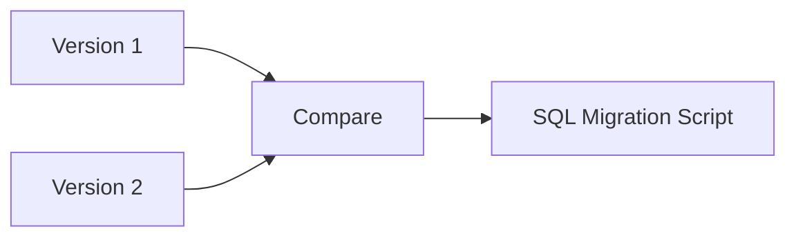
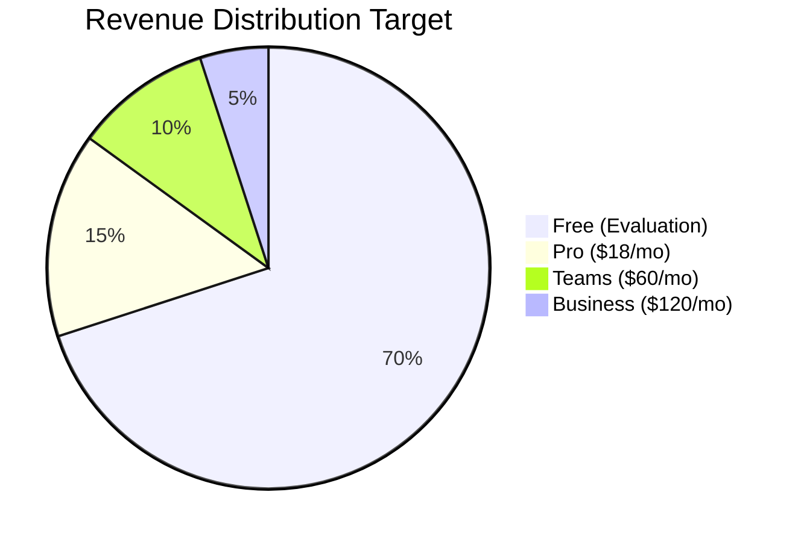

# 🗺️ Platform Roadmap

> Future features and development plans for Vizora

---

## 📊 Roadmap Overview

---

## 📋 Feature Roadmap

### ✅ Completed Features

| Feature | Status | Version |
|---------|--------|---------|
| SQL Schema Parsing | ✅ Done | v1.0 |
| Prisma Schema Parsing | ✅ Done | v1.0 |
| Drizzle ORM Parsing | ✅ Done | v1.0 |
| ER Diagram Generation | ✅ Done | v1.0 |
| AI Schema Explanations | ✅ Done | v1.0 |
| Auto Documentation (MD/PDF) | ✅ Done | v1.0 |
| Version History & Tracking | ✅ Done | v1.0 |
| Schema Designer | ✅ Done | v1.0 |
| Schema Review (AI) | ✅ Done | v1.0 |
| Ask Schema (AI) | ✅ Done | v1.0 |
| Onboarding Guide (AI) | ✅ Done | v1.0 |
| Team Workspaces | ✅ Done | v1.0 |
| Invite System | ✅ Done | v1.0 |
| Razorpay Billing | ✅ Done | v1.0 |

---

### 🔄 Planned Features

#### Stripe Integration (International Payments)

- **Priority**: High
- **Complexity**: Medium
- **Impact**: Enables international user base

#### Real-time Collaboration

- **Priority**: High
- **Complexity**: High
- **Impact**: Team productivity boost

#### Schema Migration Generator

- **Priority**: Medium
- **Complexity**: Medium
- **Impact**: Developer workflow improvement

---

### 📋 Backlog Features

#### GraphQL Schema Support
- Parse GraphQL type definitions
- Generate GraphQL resolvers
- Map to database schema

#### MongoDB Schema Support
- Parse Mongoose schemas
- JSON Schema validation
- Document relationship mapping

#### VS Code Extension
- Schema preview in editor
- Quick documentation lookup
- IntelliSense integration

#### API Documentation Generator
- OpenAPI/Swagger generation
- REST endpoint documentation
- Request/Response examples

---

## 🎯 Revenue Roadmap

### Target: $10K MRR

| Milestone | Target | Metrics |
|-----------|--------|---------|
| **Phase 1** | 100 users | Beta validation |
| **Phase 2** | 500 users | Product-market fit |
| **Phase 3** | 2,000 users | Growth phase |
| **Phase 4** | $10K MRR | Sustainable business |

---

## 🏗️ Technical Debt Roadmap

### High Priority
- [ ] Consolidate API error handling
- [ ] Add comprehensive test coverage
- [ ] Improve TypeScript strict mode

### Medium Priority
- [ ] Optimize database queries
- [ ] Add request caching layer
- [ ] Improve PDF generation performance

### Low Priority
- [ ] Refactor parser for plugin architecture
- [ ] Add GraphQL API layer
- [ ] Implement server-side rendering

---

## 📈 Success Metrics

| Metric | Current | Target |
|--------|---------|--------|
| **MAU** | Beta | 2,000 |
| **Conversion Rate** | - | 5% |
| **Retention (30d)** | - | 60% |
| **NPS Score** | - | 50+ |
| **MRR** | $0 | $10,000 |

---

## 📁 Related Notes

- [[Vizora Platform Overview]]
- [[Feature Index]]
- [[Billing System]]

---

#roadmap #planning #future #features
