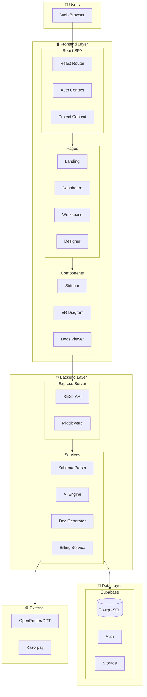
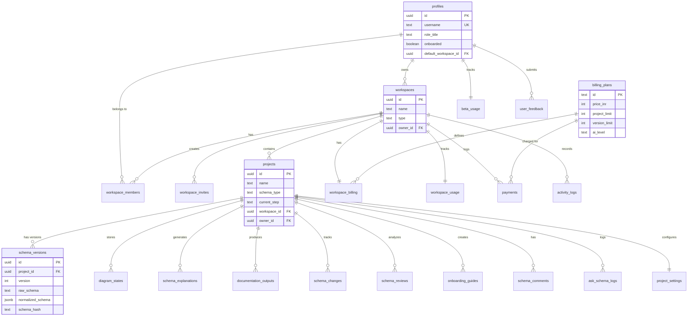
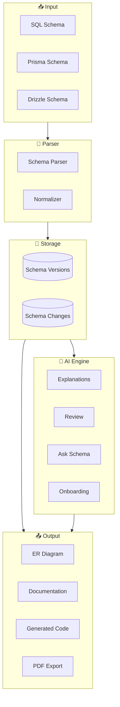
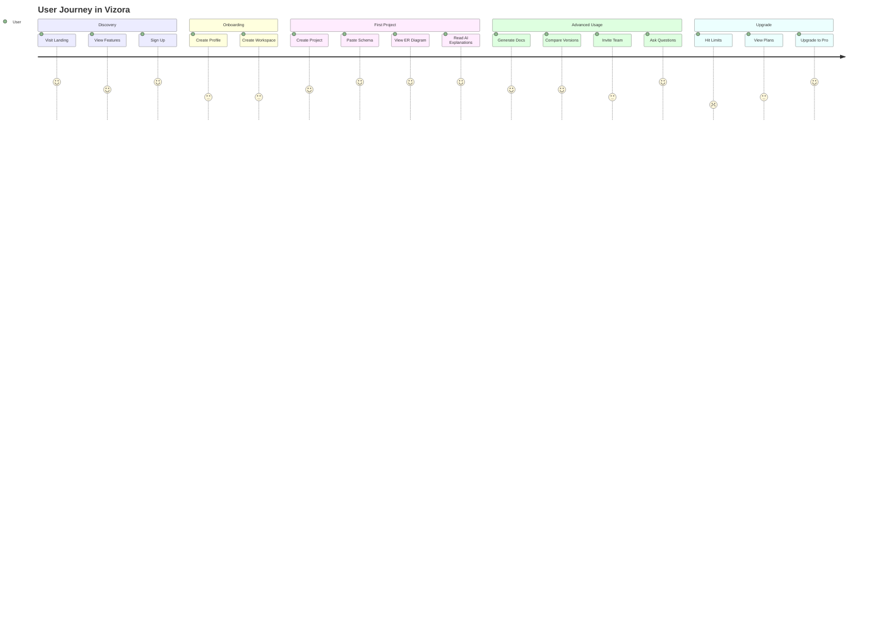
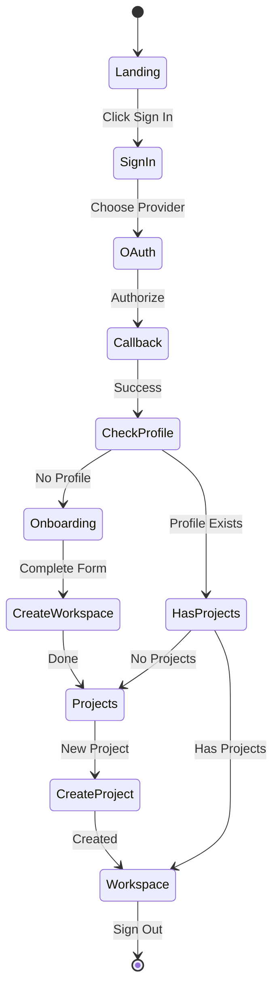
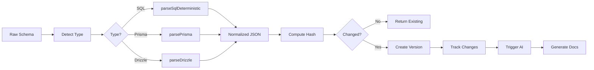

# 📐 Complete System Diagram

> Comprehensive platform architecture visualizations

---

## 🏗️ Full System Architecture

---

## 🗄️ Complete Database ERD

---

## 🔄 Data Flow Diagram

---

## 👤 User Journey

---

## 🔐 Authentication Flow

---

## 🔄 Schema Processing Pipeline

---

## 📁 Related Notes

- [[System Architecture]]
- [[Database Schema Overview]]
- [[Feature Index]]

---

#diagrams #architecture #visualization
